``` r
setwd("~/git/subgraph/mgc_based/")

require('igraph')
```

    ## Loading required package: igraph

    ## 
    ## Attaching package: 'igraph'

    ## The following objects are masked from 'package:stats':
    ## 
    ##     decompose, spectrum

    ## The following object is masked from 'package:base':
    ## 
    ##     union

``` r
require('ggplot2')
```

    ## Loading required package: ggplot2

``` r
require('fields')
```

    ## Loading required package: fields

    ## Loading required package: spam

    ## Loading required package: grid

    ## Spam version 1.4-0 (2016-08-29) is loaded.
    ## Type 'help( Spam)' or 'demo( spam)' for a short introduction 
    ## and overview of this package.
    ## Help for individual functions is also obtained by adding the
    ## suffix '.spam' to the function name, e.g. 'help( chol.spam)'.

    ## 
    ## Attaching package: 'spam'

    ## The following objects are masked from 'package:base':
    ## 
    ##     backsolve, forwardsolve

    ## Loading required package: maps

``` r
options(max.print=100)

listGs<- list.files(path = "../graphml/", pattern = "*.graphml")

#read in covariates and graph list
#find those with common ids, sort by id

covariates<- read.csv("../covariates/predictors.csv",stringsAsFactors = F)
ids <- unlist( lapply(listGs,function(x)strtrim(x,6)))
common_id<- intersect(covariates$RUNNO , ids)

covariates <- covariates[covariates$RUNNO%in%common_id,]
covariates <- covariates[order(covariates$RUNNO),]  

listGs<- listGs[ids%in%common_id]
listGs<- listGs[order(listGs)]

graphList<- lapply(listGs, function(x){
  read.graph( file = paste("../graphml/",x,sep = ""),format = "graphml")
})

AdjacencyList<- lapply(graphList, function(x){
  get.adjacency(x)
})


n = nrow(AdjacencyList[[1]])
half = c(1:(n/2))
reordered = c( half*2-1,half*2)

TriangleList <-  lapply(graphList, function(x){
  a=count_triangles(x)
  a[reordered]
})


CluscoeffList<- lapply(graphList, function(x){
  a=transitivity(x,"local")
  a[reordered]
})

AdjacencyList<- lapply(AdjacencyList, function(x){
  x[reordered,reordered]
})

HemisphereList<- lapply(graphList, function(x){
  get.vertex.attribute(x,name="hemisphere")
})

DegreeList<- lapply(AdjacencyList, function(x){
  rowSums(as.matrix(x))
  })

####

AdjacencyListPick =  list()
TriangleListPick =list()
CluscoeffListPick = list()
for(i in 1:length(AdjacencyList)){
  if(covariates$GENOTYPE[i]>=1){
    AdjacencyListPick[[length(AdjacencyListPick)+1]] = AdjacencyList[[i]]
    TriangleListPick[[length(TriangleListPick)+1]] = TriangleList[[i]]
    CluscoeffListPick[[length(CluscoeffListPick)+1]] = CluscoeffList[[i]]
  }
}


DegreeListPick<- lapply(AdjacencyListPick, function(x){
  rowSums(as.matrix(x))
  })


GENOTYPEPick = covariates$GENOTYPE[covariates$GENOTYPE>=1]

SEXPick = covariates$GENDER[covariates$GENOTYPE>=1]

m = length(GENOTYPEPick)
```

``` r
pick1= c(63, 52, 60,62,164,166,121,123,74,158,92,93,94,95,96)

sg = lapply(AdjacencyListPick, function(x){
  pick = c(pick1, pick1+166)
  as.matrix(x[pick,pick])
})

image.plot(sg[[4]])
```

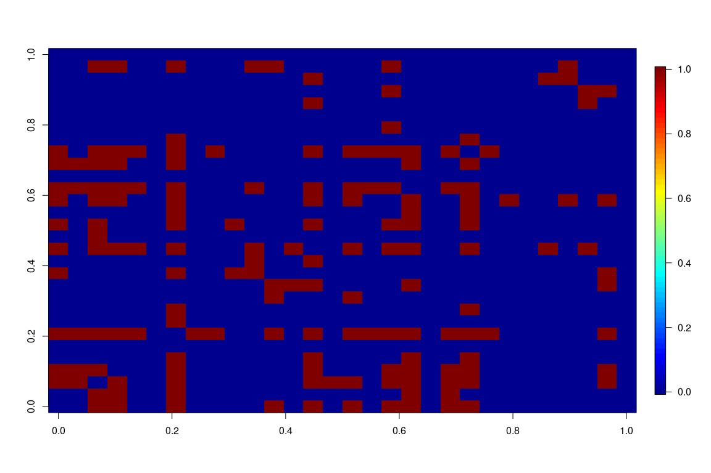

``` r
plot_and_test <- function(total_edges){
  
  df = data.frame("total_edges"=total_edges, "id"= as.factor((c(1:m))),"genotype"= as.factor(GENOTYPEPick),"sex"= as.factor(SEXPick))

  p = ggplot(data=df, aes(x= 1, y=total_edges,col=genotype,group=genotype))+ geom_point()+ geom_jitter(width = 0.5, height = 0)+geom_boxplot(alpha=0.5)+facet_grid(~genotype)
  print(p)
  
  x1 = df$total_edges[df$genotype==1]
  x2 = df$total_edges[df$genotype==2]
  
  print(wilcox.test(x1,x2, alternative = "two.sided"))
  print(kruskal.test(df$total_edges~as.factor(df$genotype)))

}

check4<- function(pick){
  
  #total
  pick_L= pick
  pick_R= pick+n_sg/2
  pick_F = c(pick_L,pick_R)
  
  print("Both hemispheres")
  #whole
  total_edges = sapply(sg, function(x) sum(x[pick_F,pick_F]))
  plot_and_test(total_edges)
    print("Left hemispheres")

  #Left
  total_edges = sapply(sg, function(x) sum(x[pick_L,pick_L]))
  plot_and_test(total_edges)
    print("Right hemispheres")

  #right
  total_edges = sapply(sg, function(x) sum(x[pick_R,pick_R]))
  plot_and_test(total_edges)
    print("Between hemispheres")

  #across
  total_edges = sapply(sg, function(x) sum(x[pick_L,pick_R]))
  plot_and_test(total_edges)


}
```

List of regions:

1.  septum 63 hippocampus 52 hypothalamus circuit 60 62 164 166

2.  fimbria-fornix 121 123

3.  possibly thalamic nuclei 74 158

4.  cerebellum 92 93 94 95 96

Total connectivities in all 4 regions
=====================================

``` r
n_sg= nrow(sg[[1]])
pick2 = 1:(n_sg/2)
check4(pick2)
```

    ## [1] "Both hemispheres"

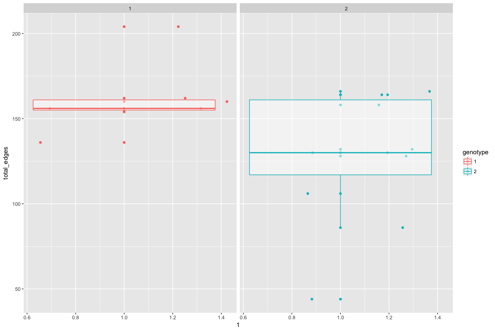

    ## 
    ##  Wilcoxon rank sum test with continuity correction
    ## 
    ## data:  x1 and x2
    ## W = 55, p-value = 0.1467
    ## alternative hypothesis: true location shift is not equal to 0
    ## 
    ## 
    ##  Kruskal-Wallis rank sum test
    ## 
    ## data:  df$total_edges by as.factor(df$genotype)
    ## Kruskal-Wallis chi-squared = 2.24, df = 1, p-value = 0.1345
    ## 
    ## [1] "Left hemispheres"

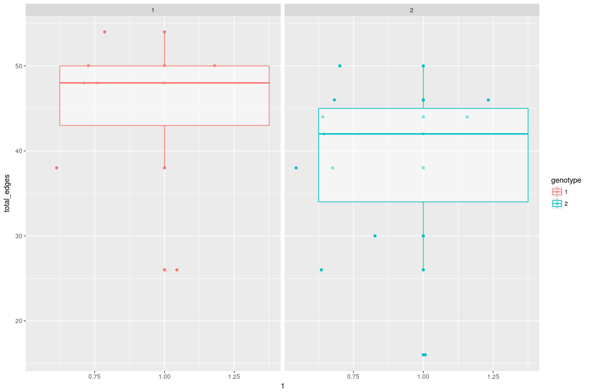

    ## 
    ##  Wilcoxon rank sum test with continuity correction
    ## 
    ## data:  x1 and x2
    ## W = 57.5, p-value = 0.0918
    ## alternative hypothesis: true location shift is not equal to 0
    ## 
    ## 
    ##  Kruskal-Wallis rank sum test
    ## 
    ## data:  df$total_edges by as.factor(df$genotype)
    ## Kruskal-Wallis chi-squared = 2.9982, df = 1, p-value = 0.08336
    ## 
    ## [1] "Right hemispheres"

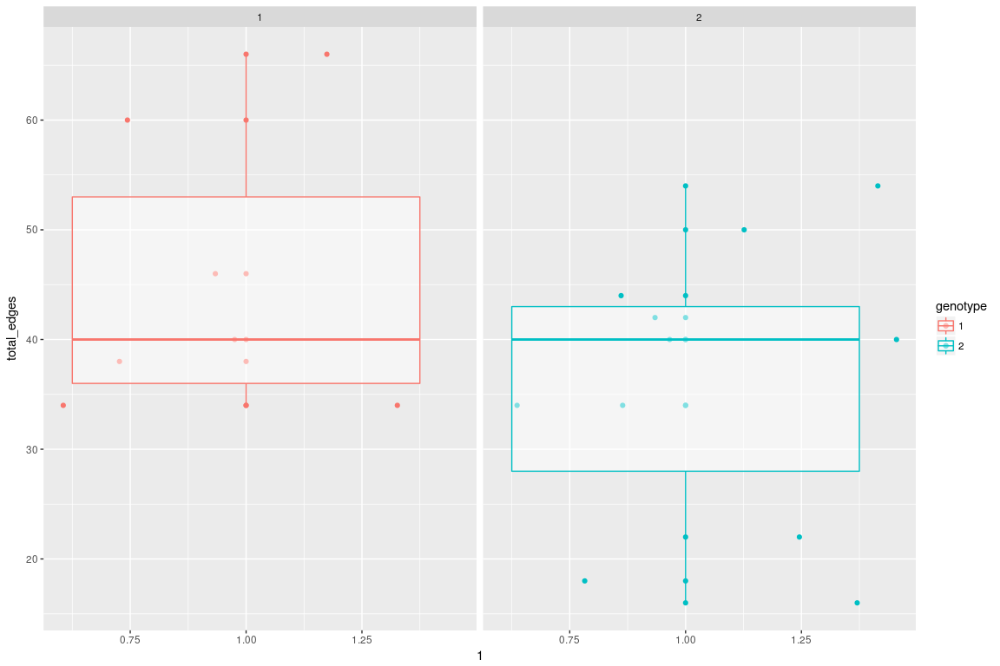

    ## 
    ##  Wilcoxon rank sum test with continuity correction
    ## 
    ## data:  x1 and x2
    ## W = 50, p-value = 0.3156
    ## alternative hypothesis: true location shift is not equal to 0
    ## 
    ## 
    ##  Kruskal-Wallis rank sum test
    ## 
    ## data:  df$total_edges by as.factor(df$genotype)
    ## Kruskal-Wallis chi-squared = 1.1007, df = 1, p-value = 0.2941
    ## 
    ## [1] "Between hemispheres"

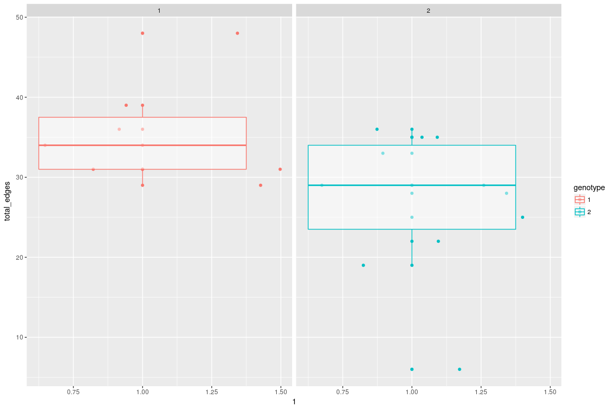

    ## 
    ##  Wilcoxon rank sum test with continuity correction
    ## 
    ## data:  x1 and x2
    ## W = 60.5, p-value = 0.05067
    ## alternative hypothesis: true location shift is not equal to 0
    ## 
    ## 
    ##  Kruskal-Wallis rank sum test
    ## 
    ## data:  df$total_edges by as.factor(df$genotype)
    ## Kruskal-Wallis chi-squared = 3.9988, df = 1, p-value = 0.04553

region 1:
---------

septum 63 hippocampus 52 hypothalamus circuit 60 62 164 166

### septum and hippocampus

``` r
pick2 = c(1:2)
check4(pick2)
```

    ## [1] "Both hemispheres"

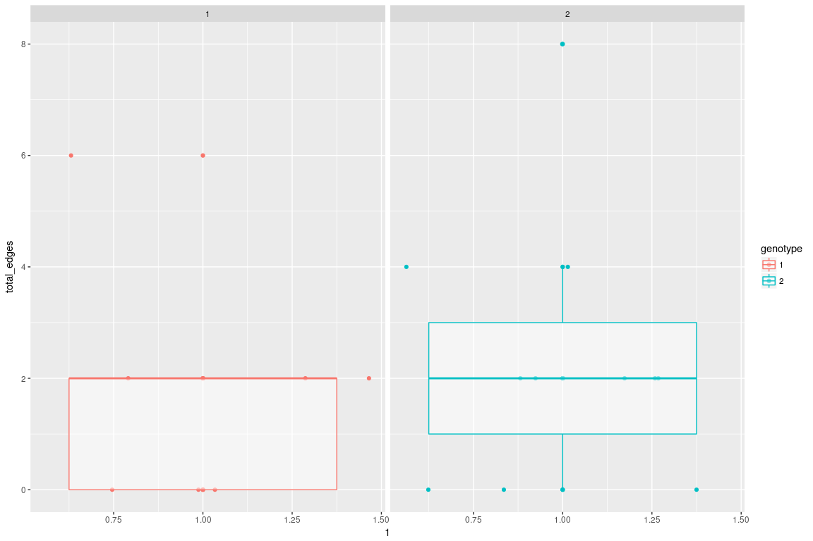

    ## 
    ##  Wilcoxon rank sum test with continuity correction
    ## 
    ## data:  x1 and x2
    ## W = 31, p-value = 0.4982
    ## alternative hypothesis: true location shift is not equal to 0
    ## 
    ## 
    ##  Kruskal-Wallis rank sum test
    ## 
    ## data:  df$total_edges by as.factor(df$genotype)
    ## Kruskal-Wallis chi-squared = 0.52659, df = 1, p-value = 0.468
    ## 
    ## [1] "Left hemispheres"

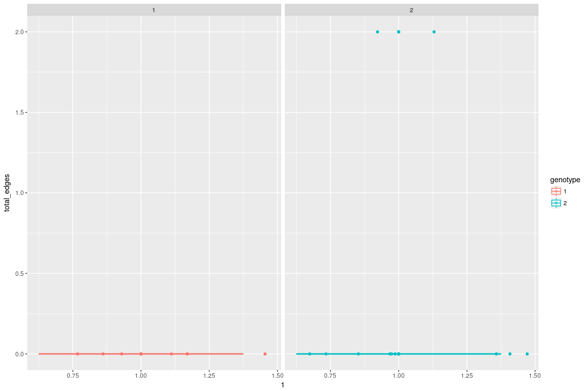

    ## 
    ##  Wilcoxon rank sum test with continuity correction
    ## 
    ## data:  x1 and x2
    ## W = 31.5, p-value = 0.2802
    ## alternative hypothesis: true location shift is not equal to 0
    ## 
    ## 
    ##  Kruskal-Wallis rank sum test
    ## 
    ## data:  df$total_edges by as.factor(df$genotype)
    ## Kruskal-Wallis chi-squared = 1.3523, df = 1, p-value = 0.2449
    ## 
    ## [1] "Right hemispheres"

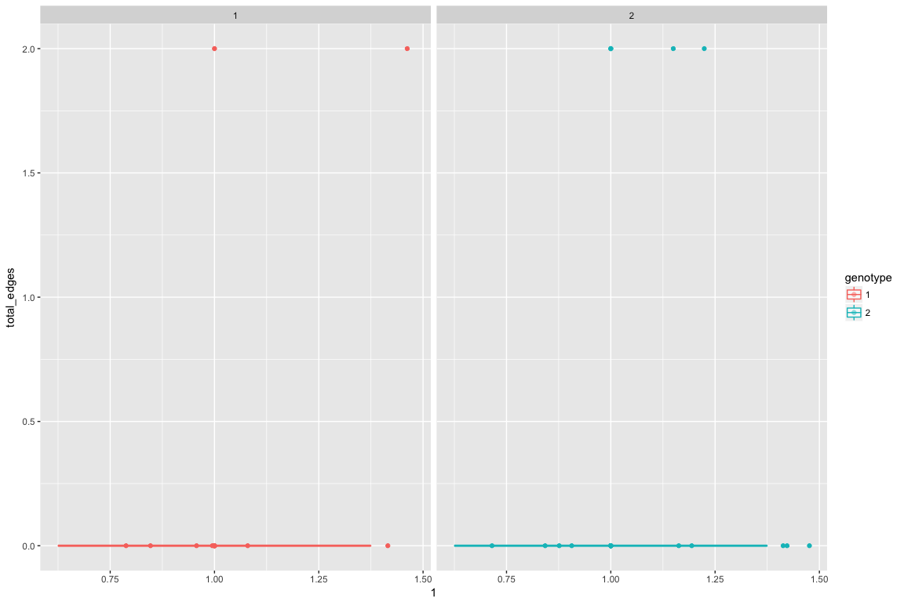

    ## 
    ##  Wilcoxon rank sum test with continuity correction
    ## 
    ## data:  x1 and x2
    ## W = 37, p-value = 0.8886
    ## alternative hypothesis: true location shift is not equal to 0
    ## 
    ## 
    ##  Kruskal-Wallis rank sum test
    ## 
    ## data:  df$total_edges by as.factor(df$genotype)
    ## Kruskal-Wallis chi-squared = 0.044156, df = 1, p-value = 0.8336
    ## 
    ## [1] "Between hemispheres"

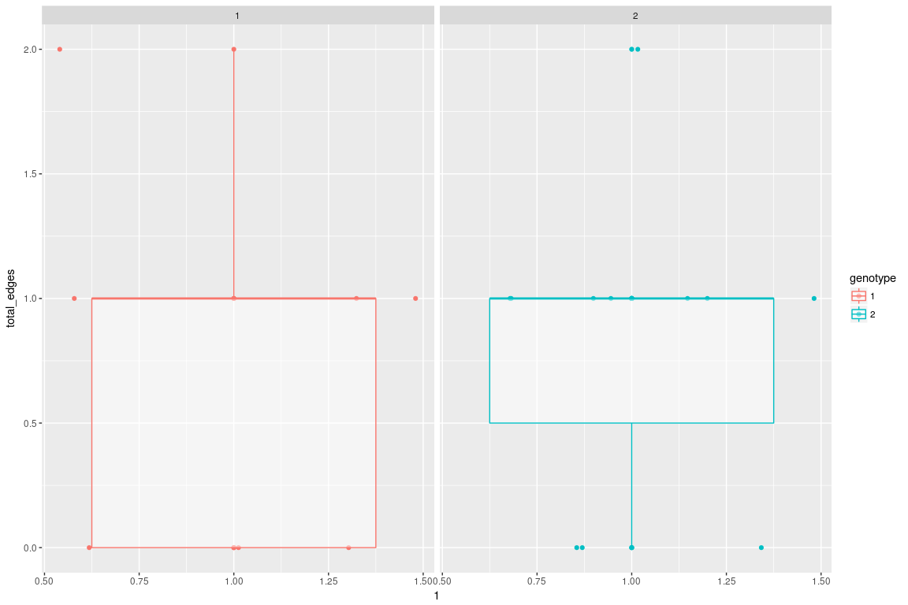

    ## 
    ##  Wilcoxon rank sum test with continuity correction
    ## 
    ## data:  x1 and x2
    ## W = 34.5, p-value = 0.7218
    ## alternative hypothesis: true location shift is not equal to 0
    ## 
    ## 
    ##  Kruskal-Wallis rank sum test
    ## 
    ## data:  df$total_edges by as.factor(df$genotype)
    ## Kruskal-Wallis chi-squared = 0.16558, df = 1, p-value = 0.6841

### hypothalamus circuit

``` r
pick2 = c(3:6)
check4(pick2)
```

    ## [1] "Both hemispheres"

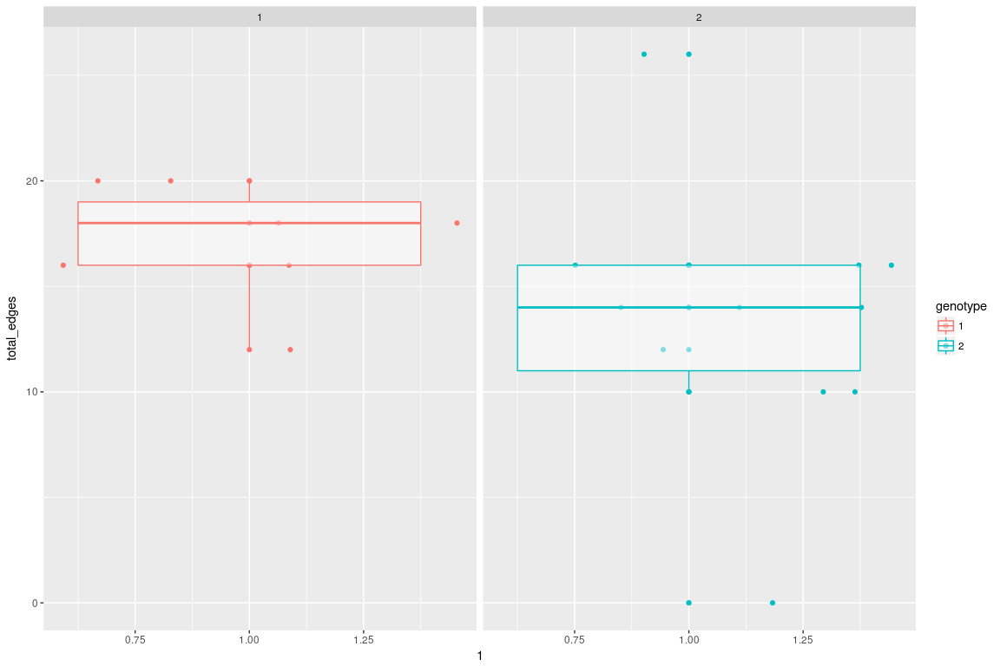

    ## 
    ##  Wilcoxon rank sum test with continuity correction
    ## 
    ## data:  x1 and x2
    ## W = 60.5, p-value = 0.04816
    ## alternative hypothesis: true location shift is not equal to 0
    ## 
    ## 
    ##  Kruskal-Wallis rank sum test
    ## 
    ## data:  df$total_edges by as.factor(df$genotype)
    ## Kruskal-Wallis chi-squared = 4.0881, df = 1, p-value = 0.04319
    ## 
    ## [1] "Left hemispheres"

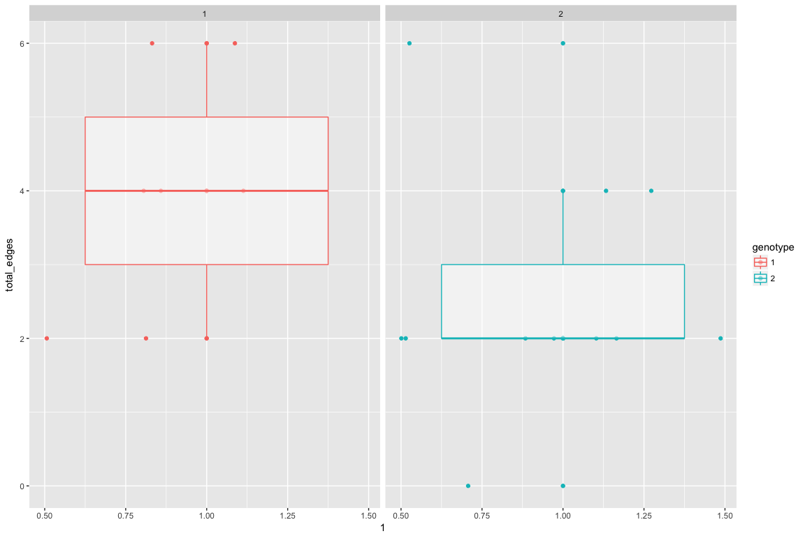

    ## 
    ##  Wilcoxon rank sum test with continuity correction
    ## 
    ## data:  x1 and x2
    ## W = 57, p-value = 0.07727
    ## alternative hypothesis: true location shift is not equal to 0
    ## 
    ## 
    ##  Kruskal-Wallis rank sum test
    ## 
    ## data:  df$total_edges by as.factor(df$genotype)
    ## Kruskal-Wallis chi-squared = 3.2972, df = 1, p-value = 0.0694
    ## 
    ## [1] "Right hemispheres"

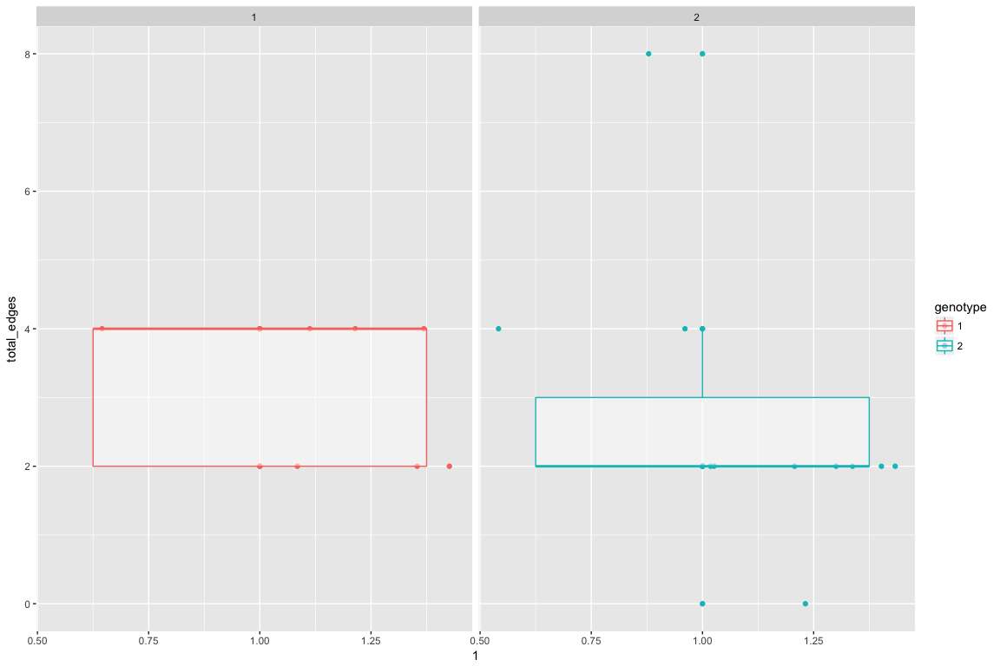

    ## 
    ##  Wilcoxon rank sum test with continuity correction
    ## 
    ## data:  x1 and x2
    ## W = 49.5, p-value = 0.2858
    ## alternative hypothesis: true location shift is not equal to 0
    ## 
    ## 
    ##  Kruskal-Wallis rank sum test
    ## 
    ## data:  df$total_edges by as.factor(df$genotype)
    ## Kruskal-Wallis chi-squared = 1.2506, df = 1, p-value = 0.2634
    ## 
    ## [1] "Between hemispheres"

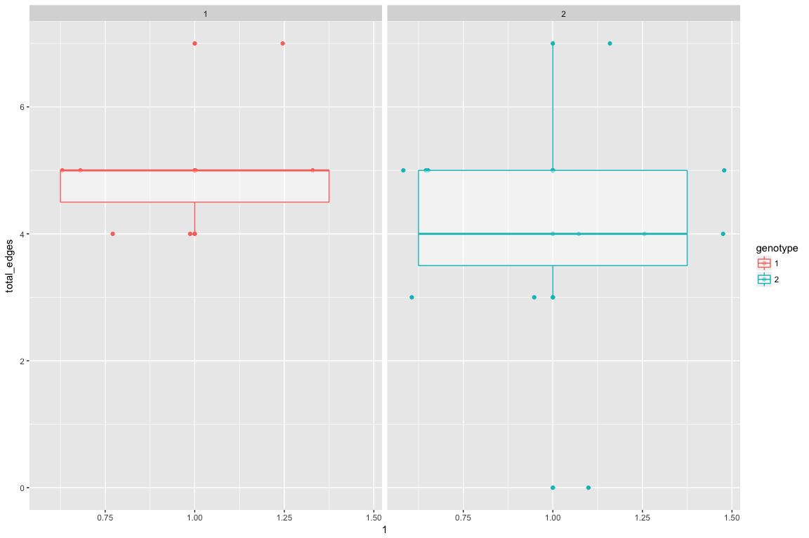

    ## 
    ##  Wilcoxon rank sum test with continuity correction
    ## 
    ## data:  x1 and x2
    ## W = 51.5, p-value = 0.2303
    ## alternative hypothesis: true location shift is not equal to 0
    ## 
    ## 
    ##  Kruskal-Wallis rank sum test
    ## 
    ## data:  df$total_edges by as.factor(df$genotype)
    ## Kruskal-Wallis chi-squared = 1.5565, df = 1, p-value = 0.2122

### septum and hippocampus + hypothalamus circuit

``` r
pick2 = c(1:6)
check4(pick2)
```

    ## [1] "Both hemispheres"

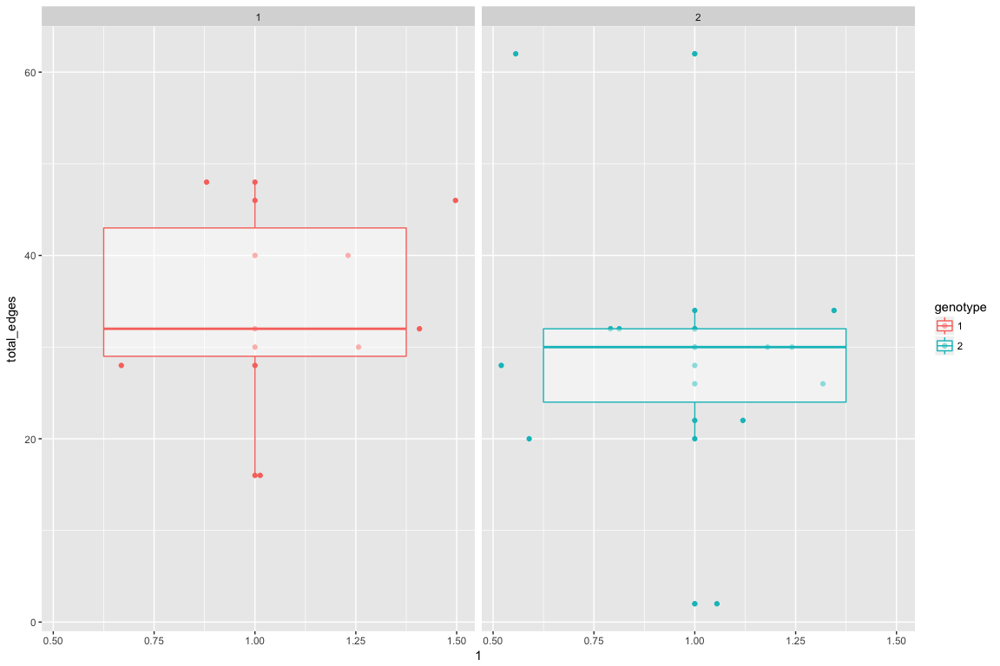

    ## 
    ##  Wilcoxon rank sum test with continuity correction
    ## 
    ## data:  x1 and x2
    ## W = 49.5, p-value = 0.3394
    ## alternative hypothesis: true location shift is not equal to 0
    ## 
    ## 
    ##  Kruskal-Wallis rank sum test
    ## 
    ## data:  df$total_edges by as.factor(df$genotype)
    ## Kruskal-Wallis chi-squared = 1.0018, df = 1, p-value = 0.3169
    ## 
    ## [1] "Left hemispheres"

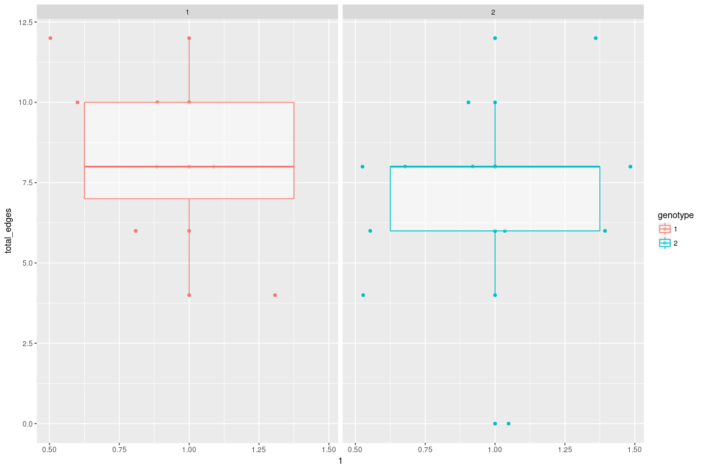

    ## 
    ##  Wilcoxon rank sum test with continuity correction
    ## 
    ## data:  x1 and x2
    ## W = 48.5, p-value = 0.3767
    ## alternative hypothesis: true location shift is not equal to 0
    ## 
    ## 
    ##  Kruskal-Wallis rank sum test
    ## 
    ## data:  df$total_edges by as.factor(df$genotype)
    ## Kruskal-Wallis chi-squared = 0.8658, df = 1, p-value = 0.3521
    ## 
    ## [1] "Right hemispheres"

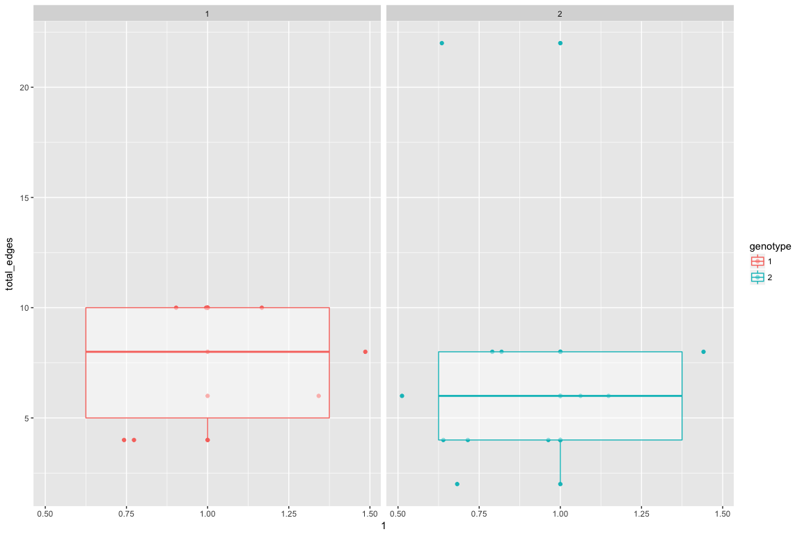

    ## 
    ##  Wilcoxon rank sum test with continuity correction
    ## 
    ## data:  x1 and x2
    ## W = 49, p-value = 0.3539
    ## alternative hypothesis: true location shift is not equal to 0
    ## 
    ## 
    ##  Kruskal-Wallis rank sum test
    ## 
    ## data:  df$total_edges by as.factor(df$genotype)
    ## Kruskal-Wallis chi-squared = 0.94732, df = 1, p-value = 0.3304
    ## 
    ## [1] "Between hemispheres"

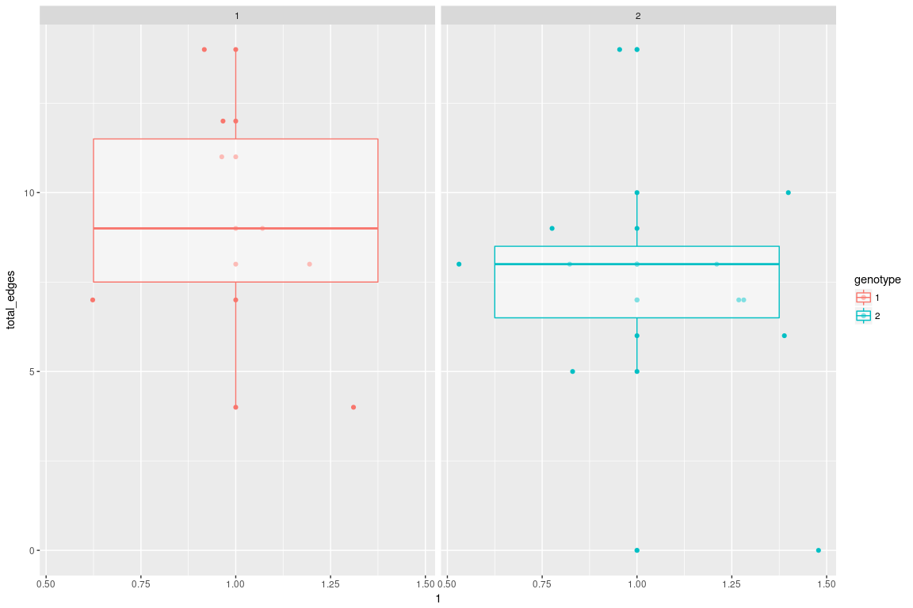

    ## 
    ##  Wilcoxon rank sum test with continuity correction
    ## 
    ## data:  x1 and x2
    ## W = 50.5, p-value = 0.2936
    ## alternative hypothesis: true location shift is not equal to 0
    ## 
    ## 
    ##  Kruskal-Wallis rank sum test
    ## 
    ## data:  df$total_edges by as.factor(df$genotype)
    ## Kruskal-Wallis chi-squared = 1.201, df = 1, p-value = 0.2731

total\_edges = sapply(sg, function(x) sum(x\[pick2, (pick2+n\_sg/2) \]))

df = data.frame("total\_edges"=total\_edges, "id"= as.factor((c(1:m))),"genotype"= as.factor(GENOTYPEPick),"sex"= as.factor(SEXPick))

ggplot(data=df, aes(x= 1, y=total\_edges,col=genotype,group=genotype))+ geom\_point()+geom\_jitter()+geom\_boxplot(alpha=0.5)+facet\_grid(~genotype)

x1 = df*t**o**t**a**l*<sub>*e*</sub>*d**g**e**s*\[*d**f*genotype==1\] x2 = df*t**o**t**a**l*<sub>*e*</sub>*d**g**e**s*\[*d**f*genotype==2\]

wilcox.test(x1,x2, alternative = "two.sided") kruskal.test(df*t**o**t**a**l*<sub>*e*</sub>*d**g**e**s* *a**s*.*f**a**c**t**o**r*(*d**f*genotype))

region 2: fimbria-fornix 121 123
--------------------------------

``` r
pick2 = c(7:8)
check4(pick2)
```

    ## [1] "Both hemispheres"

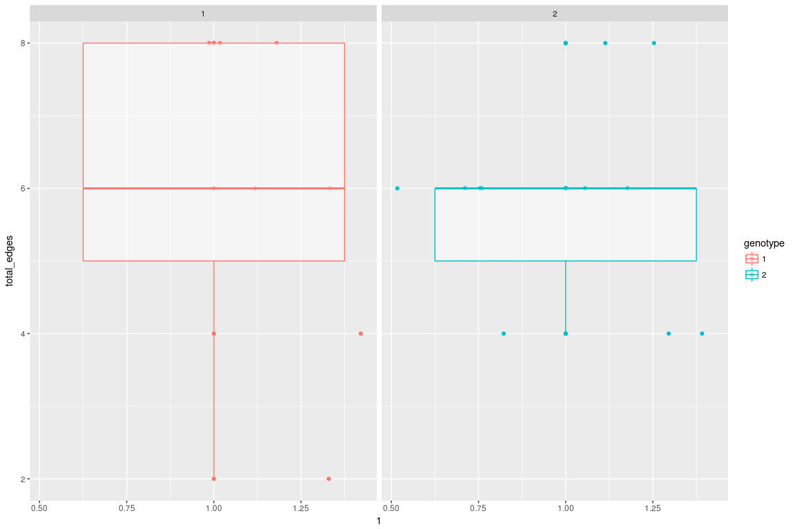

    ## 
    ##  Wilcoxon rank sum test with continuity correction
    ## 
    ## data:  x1 and x2
    ## W = 43.5, p-value = 0.6644
    ## alternative hypothesis: true location shift is not equal to 0
    ## 
    ## 
    ##  Kruskal-Wallis rank sum test
    ## 
    ## data:  df$total_edges by as.factor(df$genotype)
    ## Kruskal-Wallis chi-squared = 0.2324, df = 1, p-value = 0.6298
    ## 
    ## [1] "Left hemispheres"

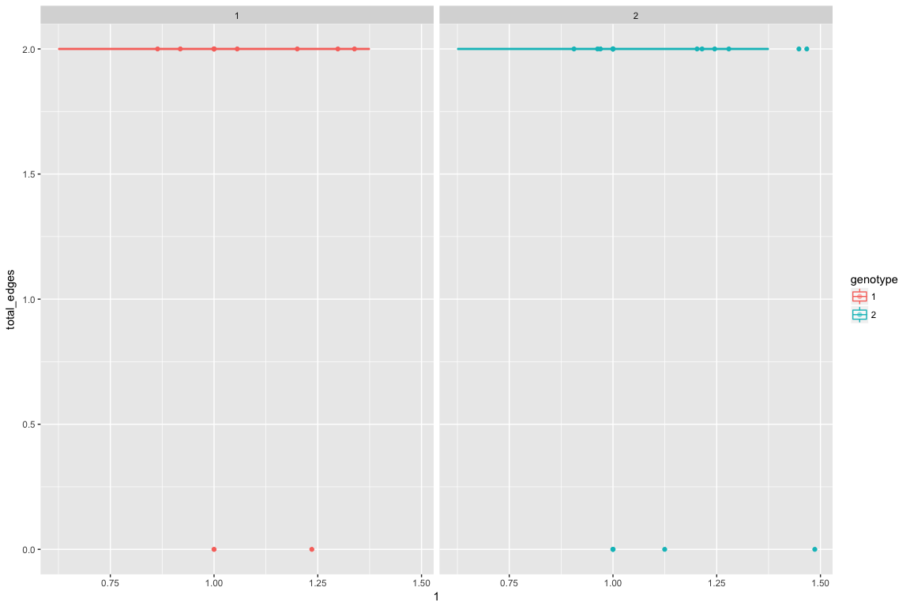

    ## 
    ##  Wilcoxon rank sum test with continuity correction
    ## 
    ## data:  x1 and x2
    ## W = 40, p-value = 0.8886
    ## alternative hypothesis: true location shift is not equal to 0
    ## 
    ## 
    ##  Kruskal-Wallis rank sum test
    ## 
    ## data:  df$total_edges by as.factor(df$genotype)
    ## Kruskal-Wallis chi-squared = 0.044156, df = 1, p-value = 0.8336
    ## 
    ## [1] "Right hemispheres"

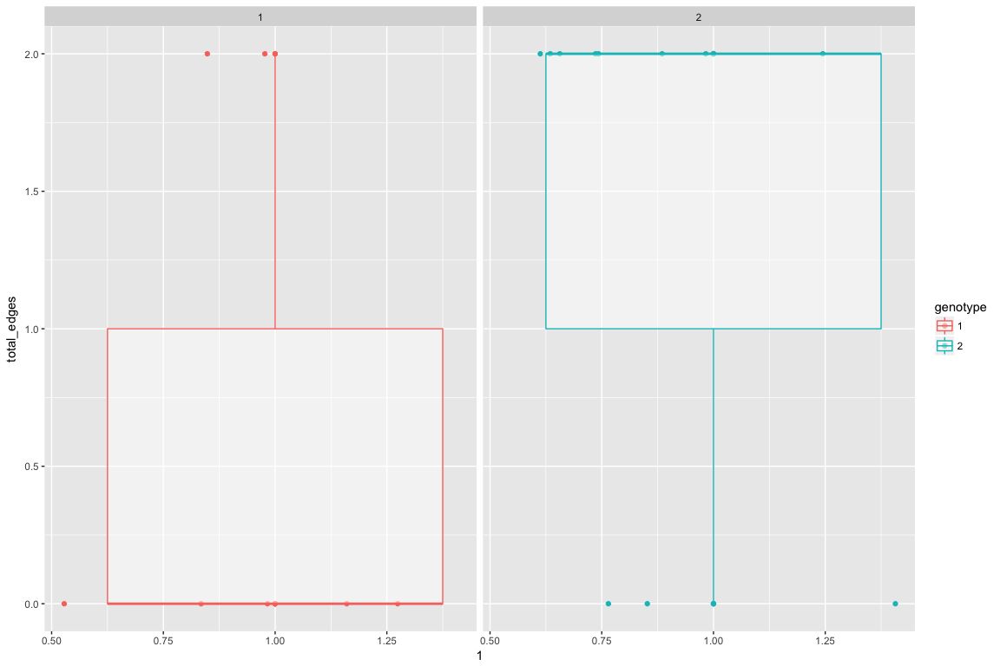

    ## 
    ##  Wilcoxon rank sum test with continuity correction
    ## 
    ## data:  x1 and x2
    ## W = 21.5, p-value = 0.08299
    ## alternative hypothesis: true location shift is not equal to 0
    ## 
    ## 
    ##  Kruskal-Wallis rank sum test
    ## 
    ## data:  df$total_edges by as.factor(df$genotype)
    ## Kruskal-Wallis chi-squared = 3.1903, df = 1, p-value = 0.07408
    ## 
    ## [1] "Between hemispheres"

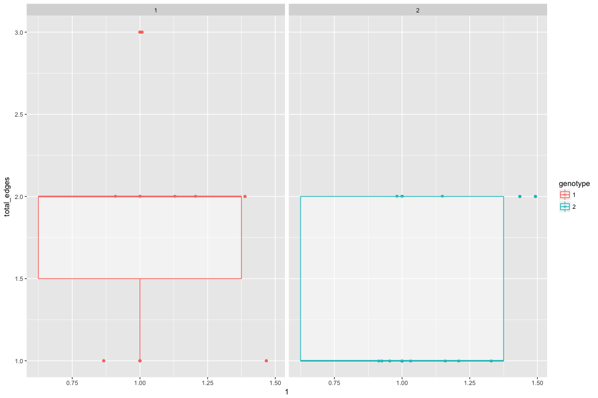

    ## 
    ##  Wilcoxon rank sum test with continuity correction
    ## 
    ## data:  x1 and x2
    ## W = 54, p-value = 0.1263
    ## alternative hypothesis: true location shift is not equal to 0
    ## 
    ## 
    ##  Kruskal-Wallis rank sum test
    ## 
    ## data:  df$total_edges by as.factor(df$genotype)
    ## Kruskal-Wallis chi-squared = 2.4961, df = 1, p-value = 0.1141

region 3: possibly thalamic nuclei 74 158
-----------------------------------------

``` r
pick2 = c(9:10)
check4(pick2)
```

    ## [1] "Both hemispheres"

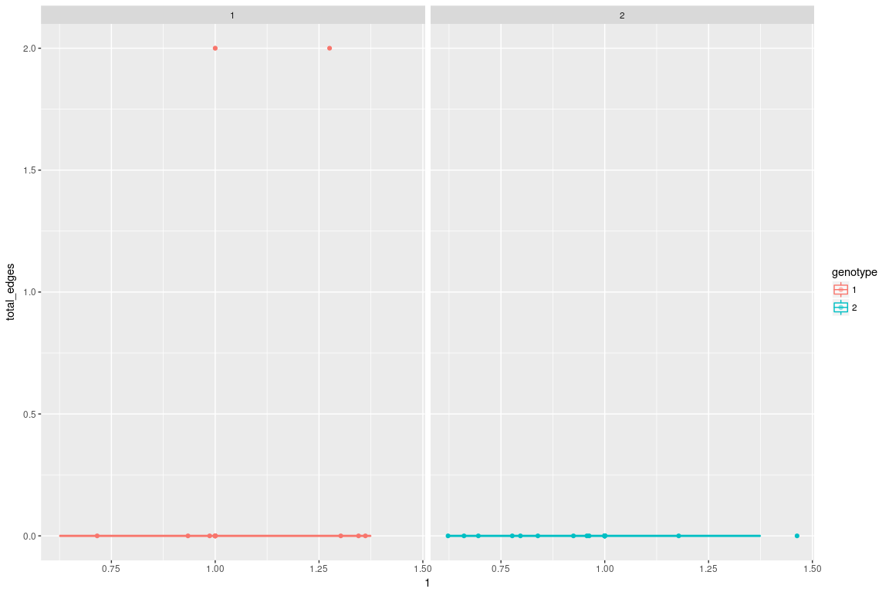

    ## 
    ##  Wilcoxon rank sum test with continuity correction
    ## 
    ## data:  x1 and x2
    ## W = 44, p-value = 0.2545
    ## alternative hypothesis: true location shift is not equal to 0
    ## 
    ## 
    ##  Kruskal-Wallis rank sum test
    ## 
    ## data:  df$total_edges by as.factor(df$genotype)
    ## Kruskal-Wallis chi-squared = 1.5714, df = 1, p-value = 0.21
    ## 
    ## [1] "Left hemispheres"

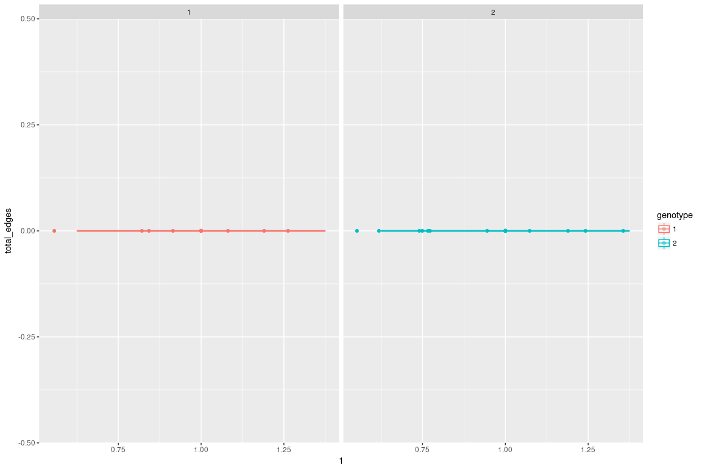

    ## 
    ##  Wilcoxon rank sum test with continuity correction
    ## 
    ## data:  x1 and x2
    ## W = 38.5, p-value = NA
    ## alternative hypothesis: true location shift is not equal to 0
    ## 
    ## 
    ##  Kruskal-Wallis rank sum test
    ## 
    ## data:  df$total_edges by as.factor(df$genotype)
    ## Kruskal-Wallis chi-squared = NaN, df = 1, p-value = NA
    ## 
    ## [1] "Right hemispheres"

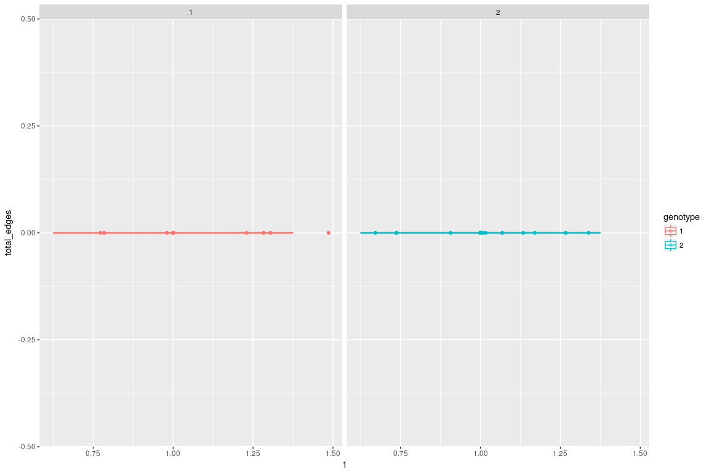

    ## 
    ##  Wilcoxon rank sum test with continuity correction
    ## 
    ## data:  x1 and x2
    ## W = 38.5, p-value = NA
    ## alternative hypothesis: true location shift is not equal to 0
    ## 
    ## 
    ##  Kruskal-Wallis rank sum test
    ## 
    ## data:  df$total_edges by as.factor(df$genotype)
    ## Kruskal-Wallis chi-squared = NaN, df = 1, p-value = NA
    ## 
    ## [1] "Between hemispheres"

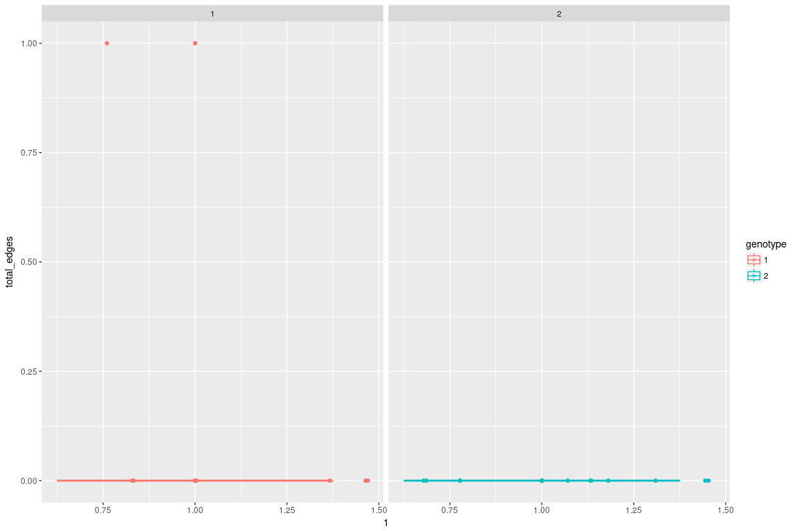

    ## 
    ##  Wilcoxon rank sum test with continuity correction
    ## 
    ## data:  x1 and x2
    ## W = 44, p-value = 0.2545
    ## alternative hypothesis: true location shift is not equal to 0
    ## 
    ## 
    ##  Kruskal-Wallis rank sum test
    ## 
    ## data:  df$total_edges by as.factor(df$genotype)
    ## Kruskal-Wallis chi-squared = 1.5714, df = 1, p-value = 0.21

region 3: cerebellum
--------------------

``` r
pick2 = c(11:15)
check4(pick2)
```

    ## [1] "Both hemispheres"

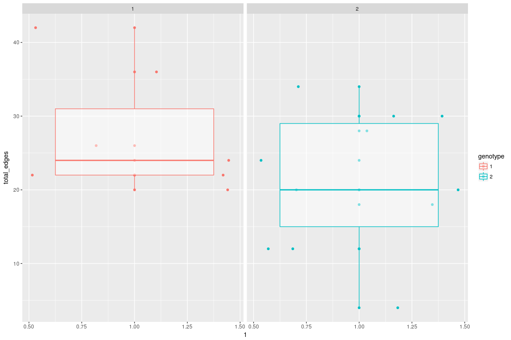

    ## 
    ##  Wilcoxon rank sum test with continuity correction
    ## 
    ## data:  x1 and x2
    ## W = 52.5, p-value = 0.2195
    ## alternative hypothesis: true location shift is not equal to 0
    ## 
    ## 
    ##  Kruskal-Wallis rank sum test
    ## 
    ## data:  df$total_edges by as.factor(df$genotype)
    ## Kruskal-Wallis chi-squared = 1.621, df = 1, p-value = 0.2029
    ## 
    ## [1] "Left hemispheres"

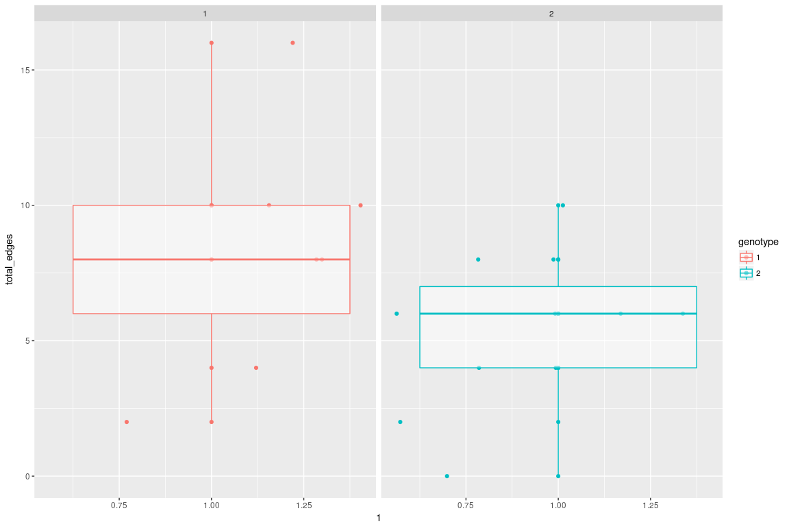

    ## 
    ##  Wilcoxon rank sum test with continuity correction
    ## 
    ## data:  x1 and x2
    ## W = 54.5, p-value = 0.1541
    ## alternative hypothesis: true location shift is not equal to 0
    ## 
    ## 
    ##  Kruskal-Wallis rank sum test
    ## 
    ## data:  df$total_edges by as.factor(df$genotype)
    ## Kruskal-Wallis chi-squared = 2.1646, df = 1, p-value = 0.1412
    ## 
    ## [1] "Right hemispheres"

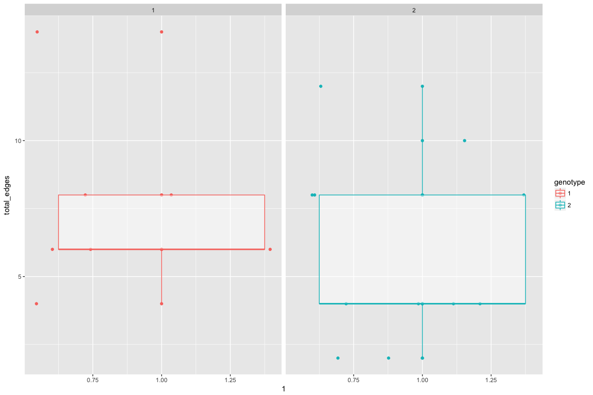

    ## 
    ##  Wilcoxon rank sum test with continuity correction
    ## 
    ## data:  x1 and x2
    ## W = 48, p-value = 0.4039
    ## alternative hypothesis: true location shift is not equal to 0
    ## 
    ## 
    ##  Kruskal-Wallis rank sum test
    ## 
    ## data:  df$total_edges by as.factor(df$genotype)
    ## Kruskal-Wallis chi-squared = 0.77631, df = 1, p-value = 0.3783
    ## 
    ## [1] "Between hemispheres"

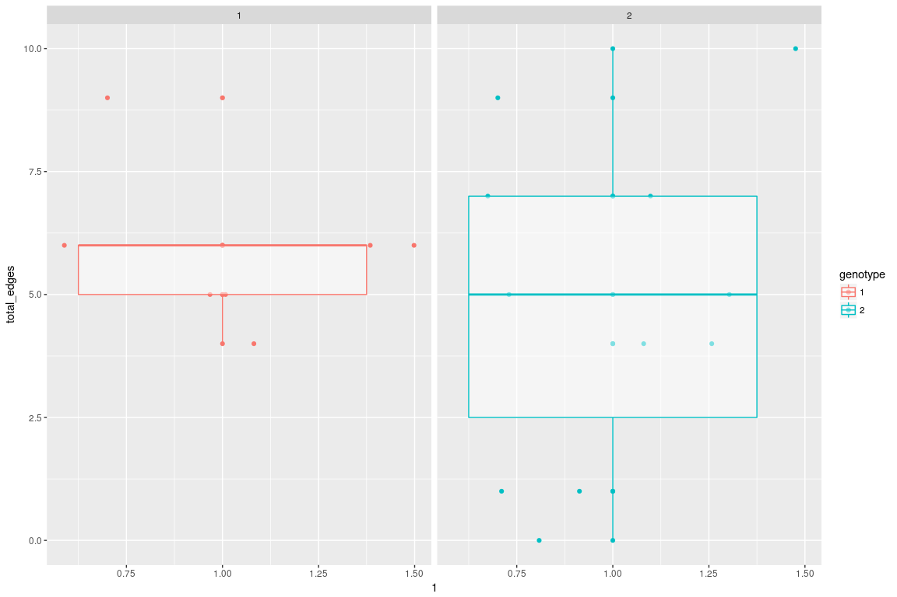

    ## 
    ##  Wilcoxon rank sum test with continuity correction
    ## 
    ## data:  x1 and x2
    ## W = 46.5, p-value = 0.4923
    ## alternative hypothesis: true location shift is not equal to 0
    ## 
    ## 
    ##  Kruskal-Wallis rank sum test
    ## 
    ## data:  df$total_edges by as.factor(df$genotype)
    ## Kruskal-Wallis chi-squared = 0.53658, df = 1, p-value = 0.4639
