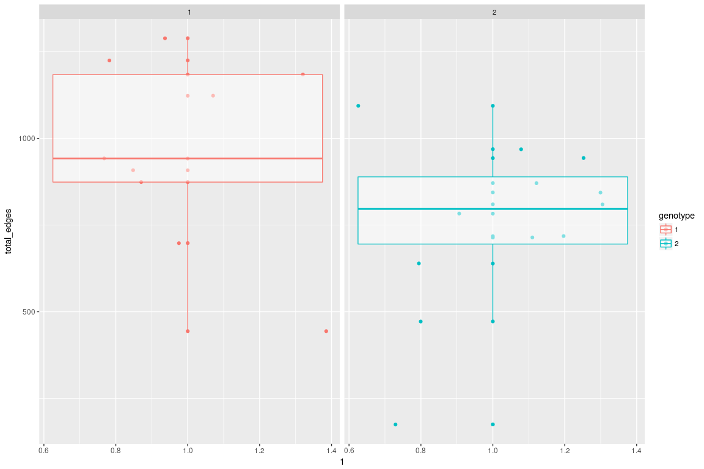
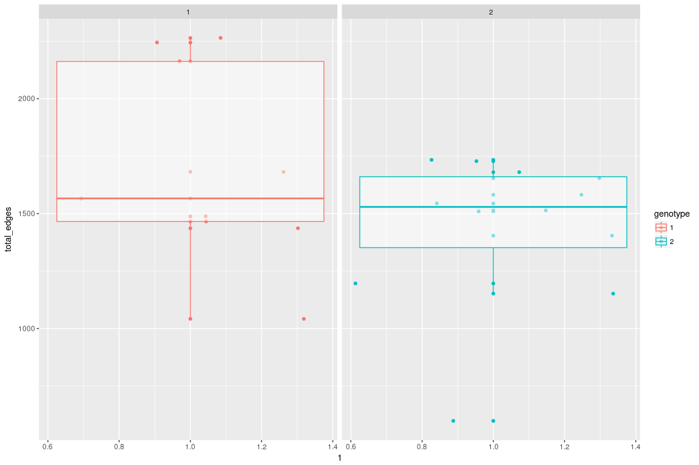
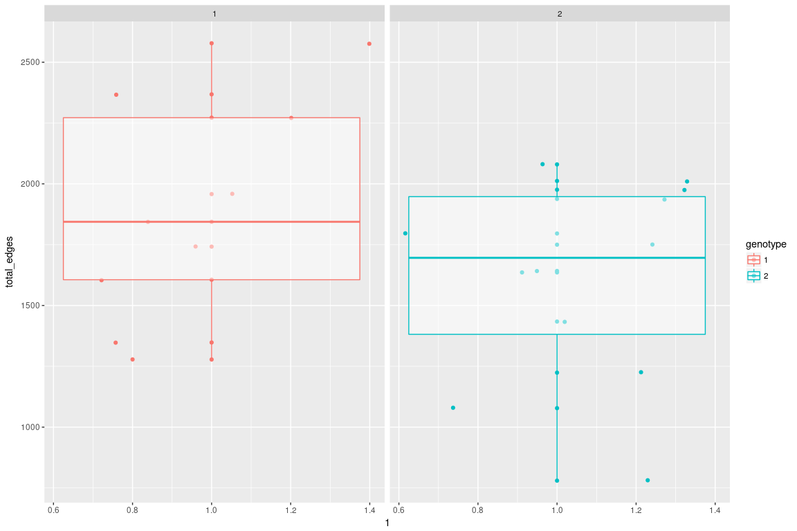
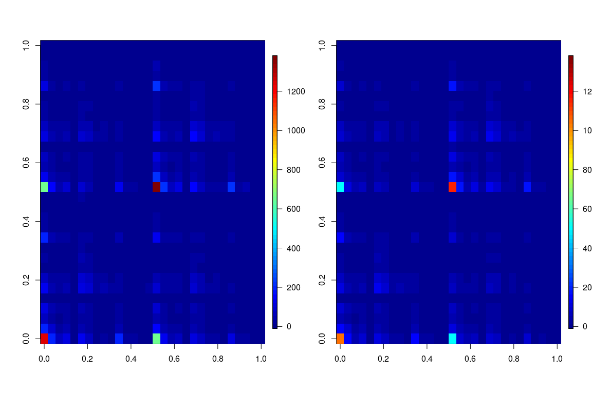
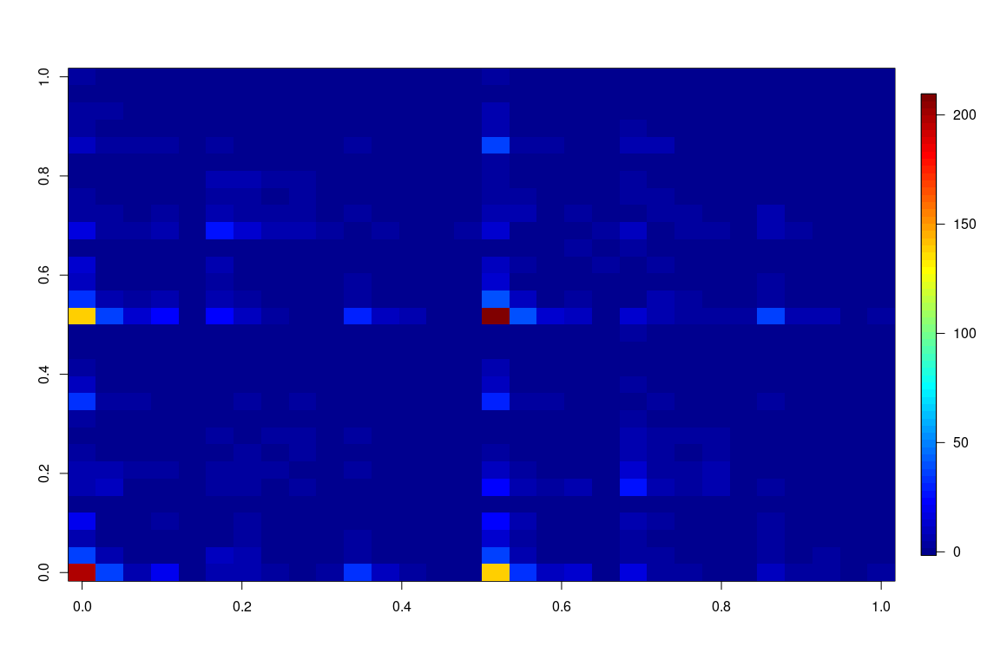
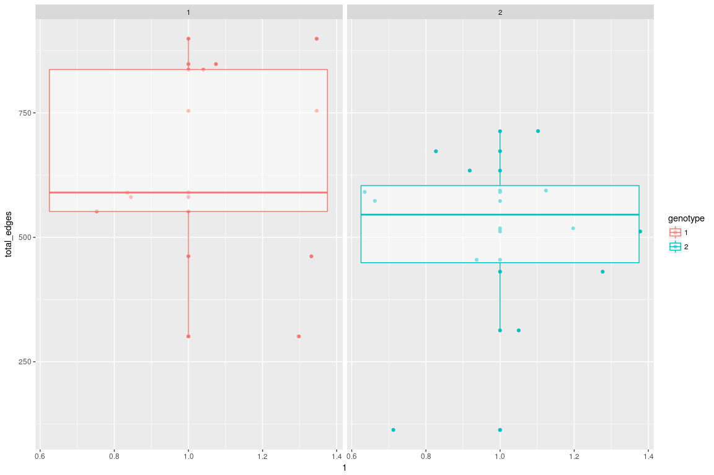
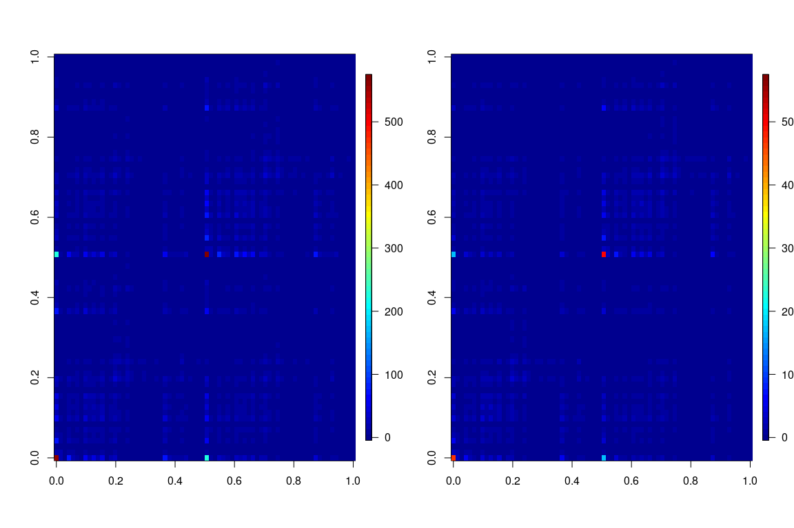

``` r
setwd("~/git/subgraph/mgc_based/")

require('igraph')
```

    ## Loading required package: igraph

    ## 
    ## Attaching package: 'igraph'

    ## The following objects are masked from 'package:stats':
    ## 
    ##     decompose, spectrum

    ## The following object is masked from 'package:base':
    ## 
    ##     union

``` r
require('ggplot2')
```

    ## Loading required package: ggplot2

``` r
require('fields')
```

    ## Loading required package: fields

    ## Loading required package: spam

    ## Loading required package: grid

    ## Spam version 1.4-0 (2016-08-29) is loaded.
    ## Type 'help( Spam)' or 'demo( spam)' for a short introduction 
    ## and overview of this package.
    ## Help for individual functions is also obtained by adding the
    ## suffix '.spam' to the function name, e.g. 'help( chol.spam)'.

    ## 
    ## Attaching package: 'spam'

    ## The following objects are masked from 'package:base':
    ## 
    ##     backsolve, forwardsolve

    ## Loading required package: maps

``` r
options(max.print=100)

listGs<- list.files(path = "../graphml/", pattern = "*.graphml")

#read in covariates and graph list
#find those with common ids, sort by id

covariates<- read.csv("../covariates/predictors.csv",stringsAsFactors = F)
ids <- unlist( lapply(listGs,function(x)strtrim(x,6)))
common_id<- intersect(covariates$RUNNO , ids)

covariates <- covariates[covariates$RUNNO%in%common_id,]
covariates <- covariates[order(covariates$RUNNO),]  

listGs<- listGs[ids%in%common_id]
listGs<- listGs[order(listGs)]

graphList<- lapply(listGs, function(x){
  read.graph( file = paste("../graphml/",x,sep = ""),format = "graphml")
})

AdjacencyList<- lapply(graphList, function(x){
  get.adjacency(x)
})


n = nrow(AdjacencyList[[1]])
half = c(1:(n/2))
reordered = c( half*2-1,half*2)

TriangleList <-  lapply(graphList, function(x){
  a=count_triangles(x)
  a[reordered]
})


CluscoeffList<- lapply(graphList, function(x){
  a=transitivity(x,"local")
  a[reordered]
})

AdjacencyList<- lapply(AdjacencyList, function(x){
  x[reordered,reordered]
})

HemisphereList<- lapply(graphList, function(x){
  get.vertex.attribute(x,name="hemisphere")
})

DegreeList<- lapply(AdjacencyList, function(x){
  rowSums(as.matrix(x))
  })

####

AdjacencyListPick =  list()
TriangleListPick =list()
CluscoeffListPick = list()
for(i in 1:length(AdjacencyList)){
  if(covariates$GENOTYPE[i]>=1){
    AdjacencyListPick[[length(AdjacencyListPick)+1]] = AdjacencyList[[i]]
    TriangleListPick[[length(TriangleListPick)+1]] = TriangleList[[i]]
    CluscoeffListPick[[length(CluscoeffListPick)+1]] = CluscoeffList[[i]]
  }
}


DegreeListPick<- lapply(AdjacencyListPick, function(x){
  rowSums(as.matrix(x))
  })


GENOTYPEPick = covariates$GENOTYPE[covariates$GENOTYPE>=1]

SEXPick = covariates$GENDER[covariates$GENOTYPE>=1]

m = length(GENOTYPEPick)
```

``` r
atlas = read.csv("../graphml/mouse_atlas.csv")

atlas = atlas[!is.na(atlas$Value),]

atlas = atlas[order(atlas$Value),]
```

``` r
regions = apply( cbind(rep(c("L","R"), n/2), as.character(atlas$Level_1)), 1, function(x)paste(x[1],x[2],sep="-"))


regionsSorted = regions[reordered]

u_regions = unique(regionsSorted)
n_regions = length(u_regions)


RegionCounts<- lapply(AdjacencyListPick, function(x){
  m = matrix(0,n_regions,n_regions)
  for(i in 1:n_regions){
    pick_i = regionsSorted == u_regions[i]
    for(j in 1:n_regions){
        pick_j = regionsSorted == u_regions[j]
        m[i,j] = sum(x[pick_i,pick_j])
      }
  }
  m
})
```

Average Adjacency Plots
=======================

Genotype 1 vs 2

``` r
geno1 = c(1:m)[GENOTYPEPick == 1]

Asum = matrix(0, n_regions,n_regions)
for(i in geno1){
    Asum = Asum + as.matrix(RegionCounts[[i]])
}

avgGeno1 = Asum/length(geno1)

geno2 = c(1:m)[GENOTYPEPick == 2]

Asum = matrix(0, n_regions,n_regions)
for(i in geno2){
    Asum = Asum + as.matrix(RegionCounts[[i]])
}

avgGeno2 = Asum/length(geno2)

par(mfrow=c(1,2))
image.plot(avgGeno1,zlim=c(0,1600))
image.plot(avgGeno2,zlim=c(0,1600))
```


Most of the regions seem to have no difference, except the connections between forebrain region (1 & 6) across L and R hemispheres:

Absolute difference in averages

``` r
image.plot(abs(avgGeno1-avgGeno2))
```


``` r
region11 = sapply(RegionCounts,function(x){
  x[1,1]
})

region16 = sapply(RegionCounts,function(x){
  x[1,6]
})

region66 = sapply(RegionCounts,function(x){
  x[6,6]
})
```

Across L-R in forebrain

``` r
df = data.frame("total_edges"= c(region16), "id"= as.factor((c(1:m))),"genotype"= as.factor(GENOTYPEPick),"sex"= as.factor(SEXPick))

ggplot(data=df, aes(x= 1, y=total_edges,col=genotype,group=genotype))+ geom_point()+geom_jitter()+geom_boxplot(alpha=0.5)+facet_grid(~genotype)
```



``` r
x1 = df$total_edges[df$genotype==1]
x2 = df$total_edges[df$genotype==2]

wilcox.test(x1,x2, alternative = "greater")
```

    ## 
    ##  Wilcoxon rank sum test
    ## 
    ## data:  x1 and x2
    ## W = 77, p-value = 0.05553
    ## alternative hypothesis: true location shift is greater than 0

``` r
kruskal.test(df$total_edges~as.factor(df$genotype))
```

    ## 
    ##  Kruskal-Wallis rank sum test
    ## 
    ## data:  df$total_edges by as.factor(df$genotype)
    ## Kruskal-Wallis chi-squared = 2.6717, df = 1, p-value = 0.1021

Within L-region forebrain

``` r
df = data.frame("total_edges"= c(region11), "id"= as.factor((c(1:m))),"genotype"= as.factor(GENOTYPEPick),"sex"= as.factor(SEXPick))

ggplot(data=df, aes(x= 1, y=total_edges,col=genotype,group=genotype))+ geom_point()+geom_jitter()+geom_boxplot(alpha=0.5)+facet_grid(~genotype)
```



``` r
x1 = df$total_edges[df$genotype==1]
x2 = df$total_edges[df$genotype==2]

wilcox.test(x1,x2, alternative = "two.sided")
```

    ## 
    ##  Wilcoxon rank sum test with continuity correction
    ## 
    ## data:  x1 and x2
    ## W = 59, p-value = 0.749
    ## alternative hypothesis: true location shift is not equal to 0

``` r
kruskal.test(df$total_edges~as.factor(df$genotype))
```

    ## 
    ##  Kruskal-Wallis rank sum test
    ## 
    ## data:  df$total_edges by as.factor(df$genotype)
    ## Kruskal-Wallis chi-squared = 0.12634, df = 1, p-value = 0.7223

Within R-region forebrain

``` r
df = data.frame("total_edges"= c(region66), "id"= as.factor((c(1:m))),"genotype"= as.factor(GENOTYPEPick),"sex"= as.factor(SEXPick))

ggplot(data=df, aes(x= 1, y=total_edges,col=genotype,group=genotype))+ geom_point()+geom_jitter()+geom_boxplot(alpha=0.5)+facet_grid(~genotype)
```



``` r
x1 = df$total_edges[df$genotype==1]
x2 = df$total_edges[df$genotype==2]

wilcox.test(x1,x2, alternative = "two.sided")
```

    ## 
    ##  Wilcoxon rank sum test
    ## 
    ## data:  x1 and x2
    ## W = 62, p-value = 0.6016
    ## alternative hypothesis: true location shift is not equal to 0

``` r
kruskal.test(df$total_edges~as.factor(df$genotype))
```

    ## 
    ##  Kruskal-Wallis rank sum test
    ## 
    ## data:  df$total_edges by as.factor(df$genotype)
    ## Kruskal-Wallis chi-squared = 0.32323, df = 1, p-value = 0.5697

Average Adjacency Plots for Sex
===============================

Sex 1 vs 2

``` r
geno1 = c(1:m)[SEXPick == 1]

Asum = matrix(0, n_regions,n_regions)
for(i in geno1){
    Asum = Asum + as.matrix(RegionCounts[[i]])
}

avgGeno1 = Asum/length(geno1)

geno2 = c(1:m)[SEXPick == 2]

Asum = matrix(0, n_regions,n_regions)
for(i in geno2){
    Asum = Asum + as.matrix(RegionCounts[[i]])
}

avgGeno2 = Asum/length(geno2)

par(mfrow=c(1,2))
image.plot(avgGeno1,zlim=c(0,1600))
image.plot(avgGeno2,zlim=c(0,1600))
```



Absolute difference in averages

``` r
image.plot(abs(avgGeno1-avgGeno2))
```



Connections within forebrain (region 1 and 6) seem to have most difference.

Across L-R in forebrain

``` r
df = data.frame("total_edges"= c(region16), "id"= as.factor((c(1:m))),"genotype"= as.factor(GENOTYPEPick),"sex"= as.factor(SEXPick))

ggplot(data=df, aes(x= 1, y=total_edges,col=sex,group=sex))+ geom_point()+geom_jitter()+geom_boxplot(alpha=0.5)+facet_grid(~sex)
```


``` r
x1 = df$total_edges[df$sex==1]
x2 = df$total_edges[df$sex==2]

wilcox.test(x1,x2, alternative = "two.sided")
```

    ## 
    ##  Wilcoxon rank sum test
    ## 
    ## data:  x1 and x2
    ## W = 59, p-value = 0.8094
    ## alternative hypothesis: true location shift is not equal to 0

``` r
kruskal.test(df$total_edges~as.factor(df$sex))
```

    ## 
    ##  Kruskal-Wallis rank sum test
    ## 
    ## data:  df$total_edges by as.factor(df$sex)
    ## Kruskal-Wallis chi-squared = 0.079339, df = 1, p-value = 0.7782

Within L-region forebrain

``` r
df = data.frame("total_edges"= c(region11), "id"= as.factor((c(1:m))),"genotype"= as.factor(GENOTYPEPick),"sex"= as.factor(SEXPick))

ggplot(data=df, aes(x= 1, y=total_edges,col=sex,group=sex))+ geom_point()+geom_jitter()+geom_boxplot(alpha=0.5)+facet_grid(~sex)
```



``` r
x1 = df$total_edges[df$sex==1]
x2 = df$total_edges[df$sex==2]

wilcox.test(x1,x2, alternative = "two.sided")
```

    ## 
    ##  Wilcoxon rank sum test with continuity correction
    ## 
    ## data:  x1 and x2
    ## W = 51, p-value = 0.8053
    ## alternative hypothesis: true location shift is not equal to 0

``` r
kruskal.test(df$total_edges~as.factor(df$sex))
```

    ## 
    ##  Kruskal-Wallis rank sum test
    ## 
    ## data:  df$total_edges by as.factor(df$sex)
    ## Kruskal-Wallis chi-squared = 0.07939, df = 1, p-value = 0.7781

Within R-region forebrain

``` r
df = data.frame("total_edges"= c(region66), "id"= as.factor((c(1:m))),"genotype"= as.factor(GENOTYPEPick),"sex"= as.factor(SEXPick))

ggplot(data=df, aes(x= 1, y=total_edges,col=sex,group=sex))+ geom_point()+geom_jitter()+geom_boxplot(alpha=0.5)+facet_grid(~sex)
```



``` r
x1 = df$total_edges[df$sex==1]
x2 = df$total_edges[df$sex==2]

wilcox.test(x1,x2, alternative = "two.sided")
```

    ## 
    ##  Wilcoxon rank sum test
    ## 
    ## data:  x1 and x2
    ## W = 51, p-value = 0.8094
    ## alternative hypothesis: true location shift is not equal to 0

``` r
kruskal.test(df$total_edges~as.factor(df$sex))
```

    ## 
    ##  Kruskal-Wallis rank sum test
    ## 
    ## data:  df$total_edges by as.factor(df$sex)
    ## Kruskal-Wallis chi-squared = 0.079339, df = 1, p-value = 0.7782
