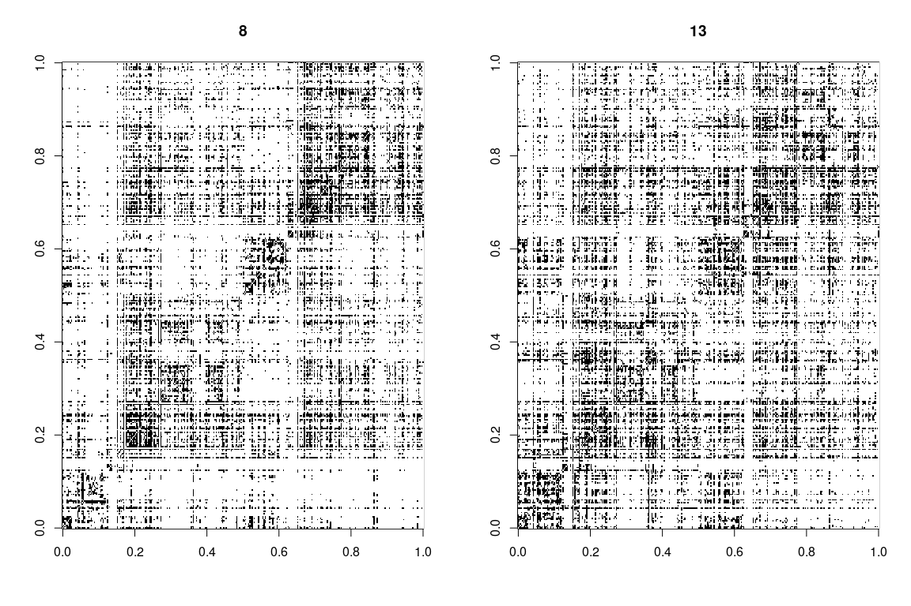
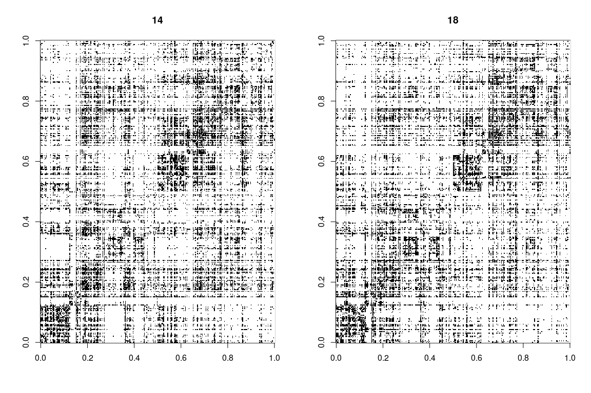
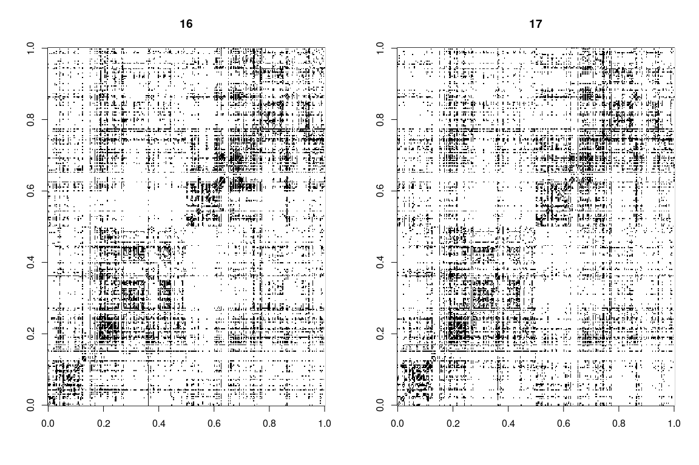
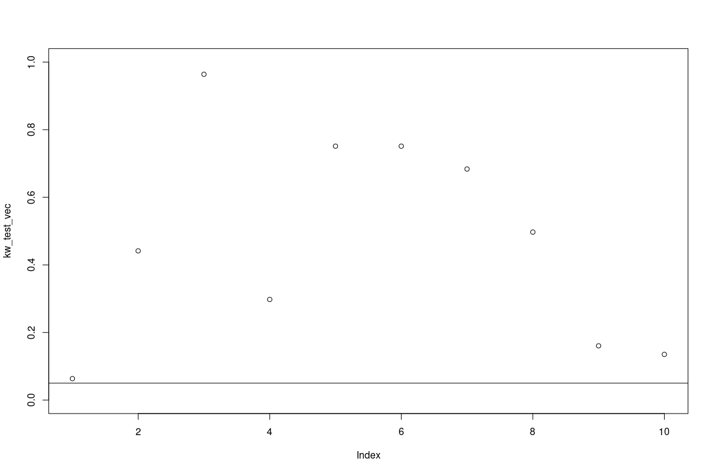
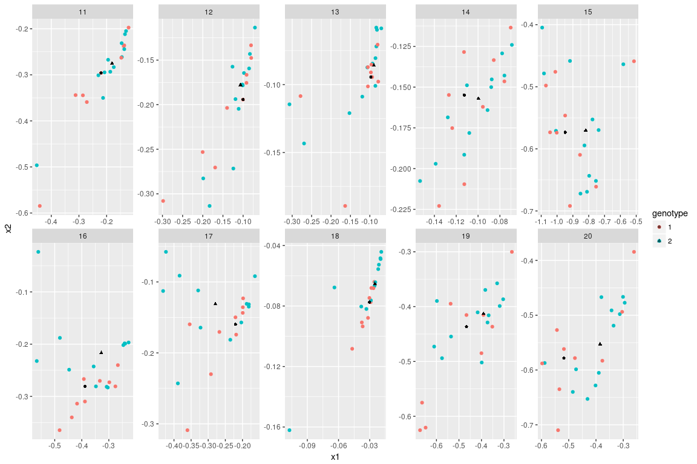
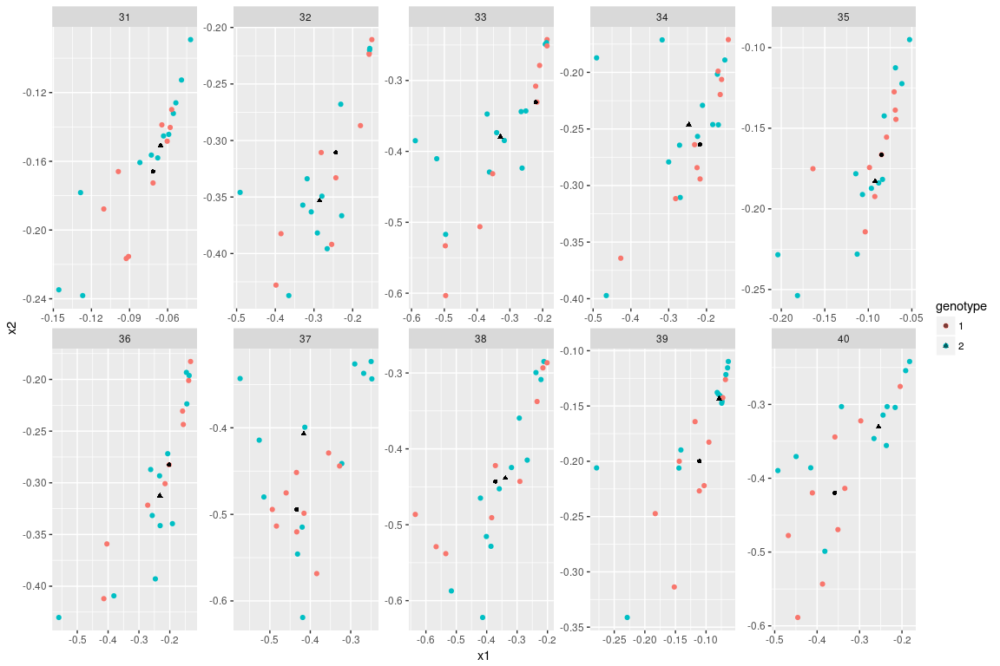
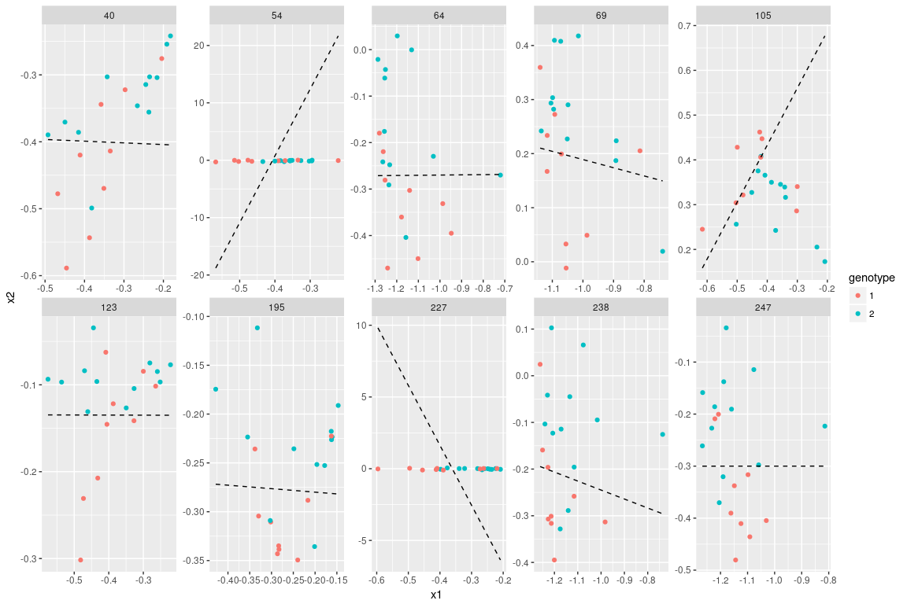
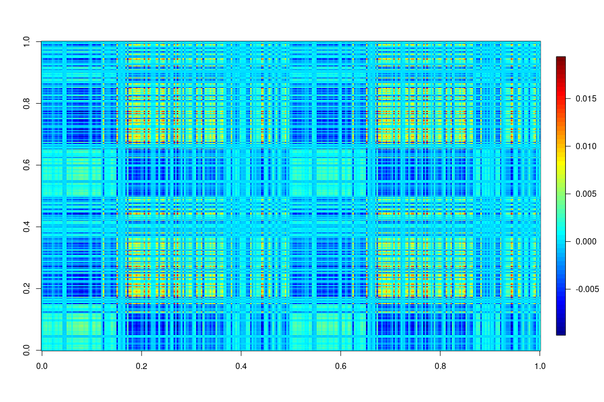

Raw Adjacency Plots
===================

Raw Adjacency Plots for Genotype 1

Raw Adjacency Plots for Genotype 2

Average Adjacency Plots
=======================

Genotype 1

 Genotype 2

Degree Distribution
===================

Plotted over two genotypes

Betweenness Centrality Distribution
===================================

Plotted over two genotypes

Left and Right
==============

Genotype1

Genotype2

Average

Genotype 1

 Genotype 2

Plot the genotype1(black) vs genotype2(red) in the edge count in each block.

