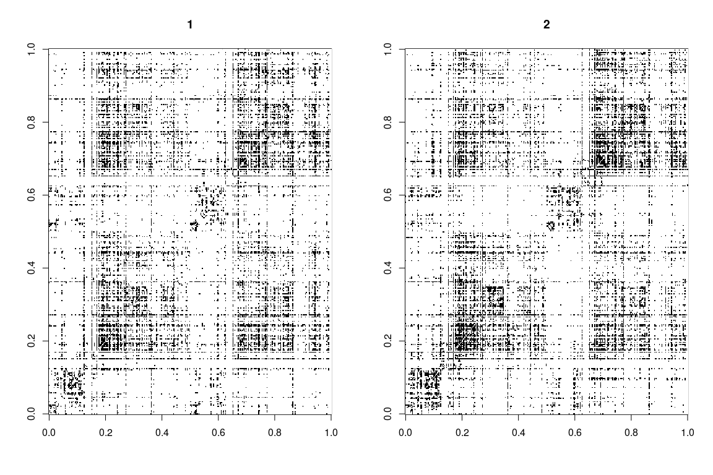
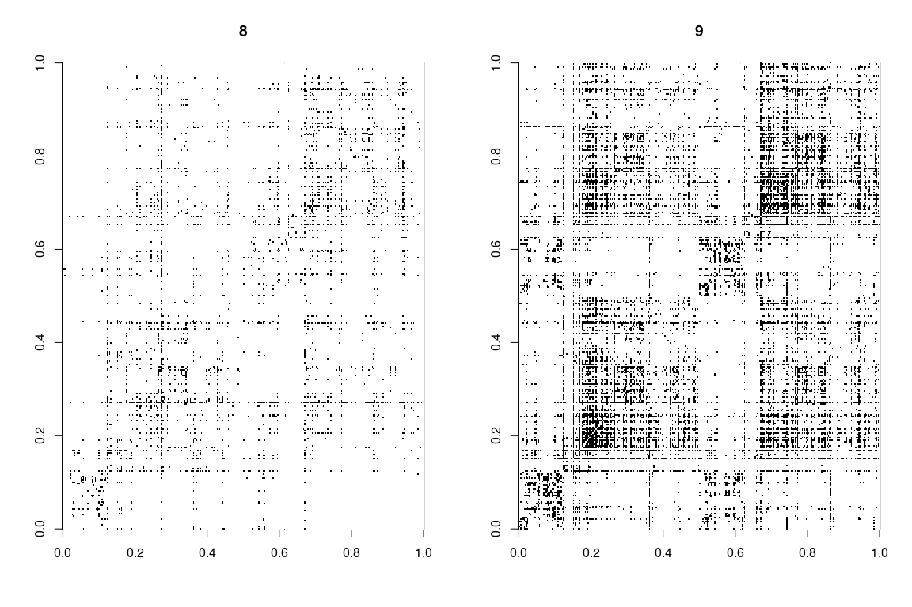
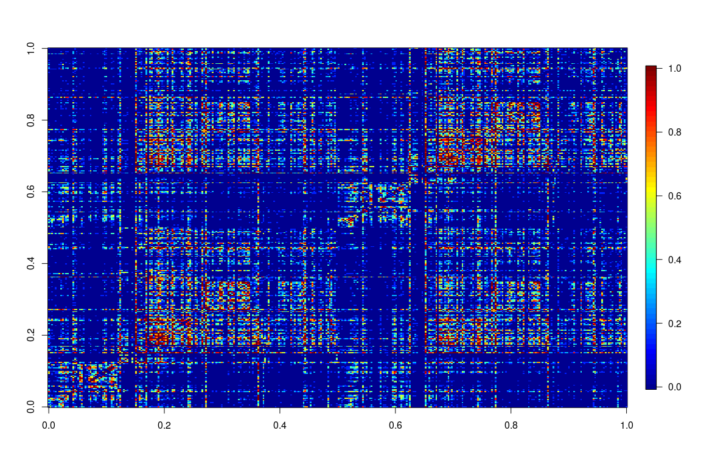
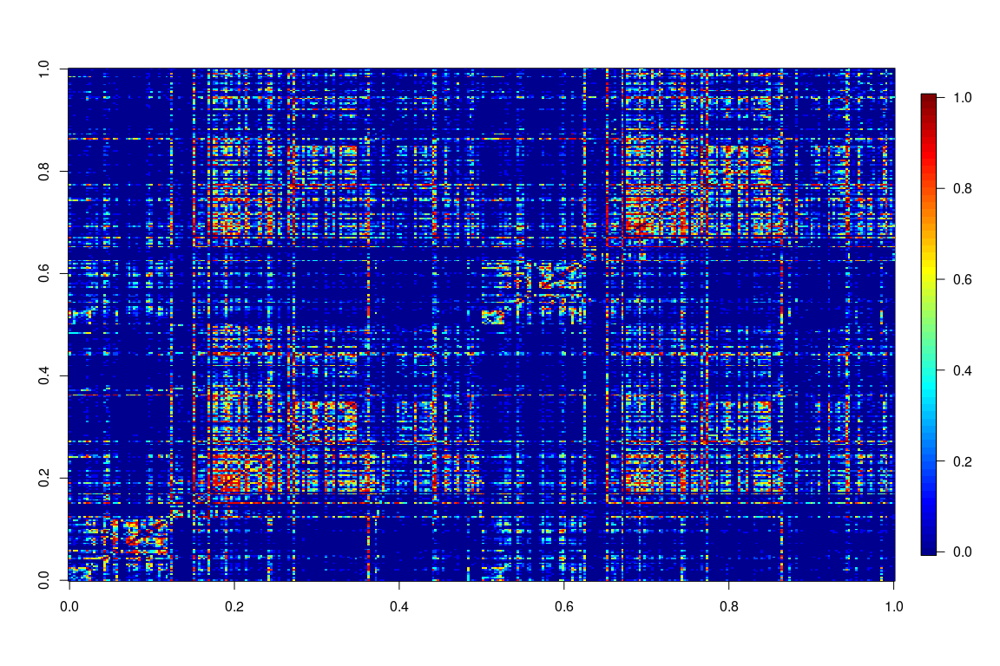
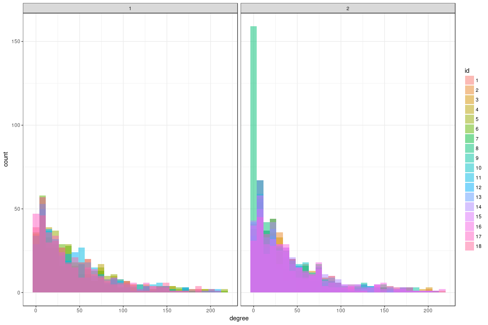
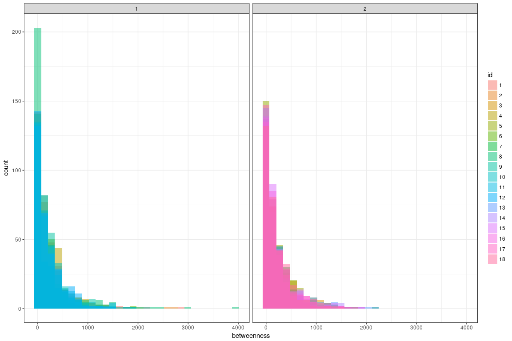
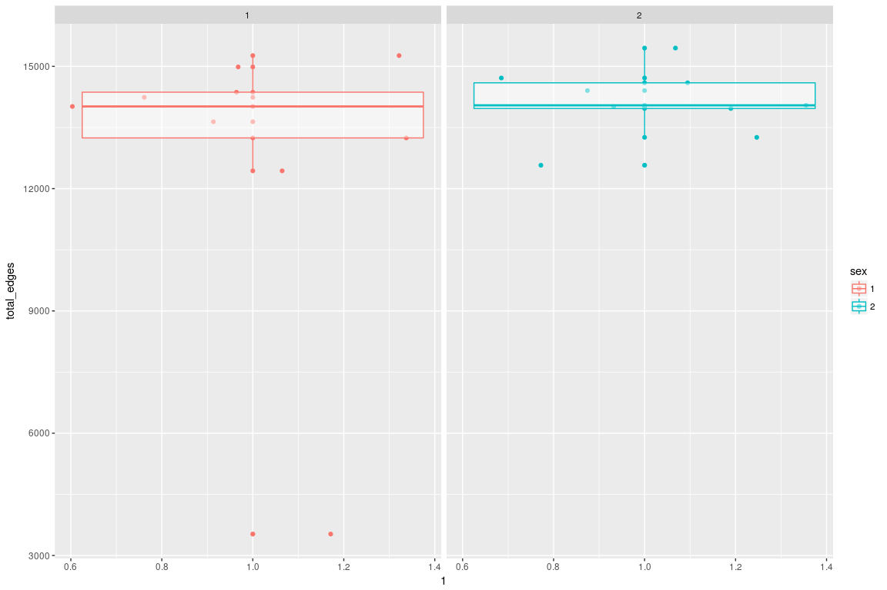
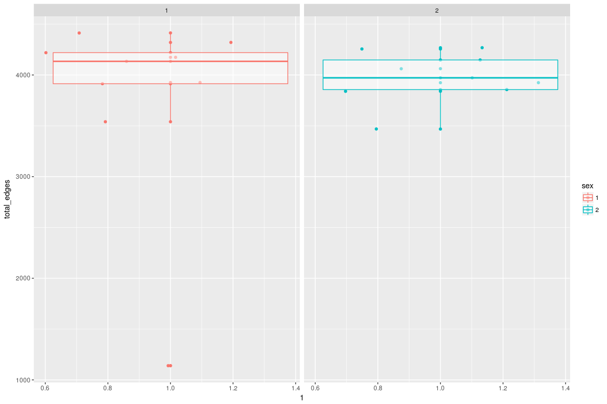
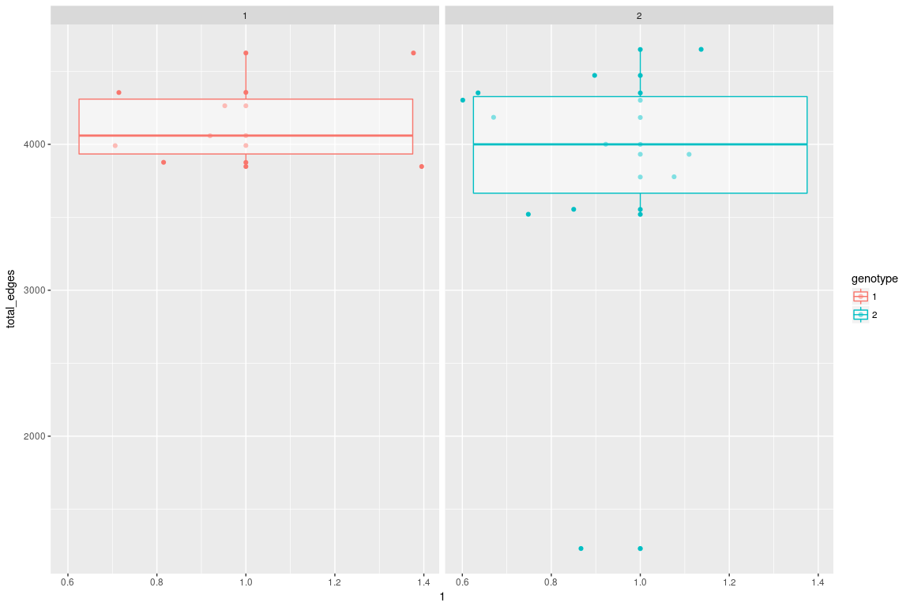

Raw Adjacency Plots
===================

Raw Adjacency Plots for Genotype 1


Raw Adjacency Plots for Genotype 2



Average Adjacency Plots
=======================

Genotype 1

 Genotype 2



Degree Distribution
===================

Plotted over two genotypes



Plotted over two sex 

Betweenness Centrality Distribution
===================================

Plotted over two genotypes


Plotted over two sex



<!-- Genotype1 -->
<!-- ```{r} -->
<!-- par(mfrow=c(1,2)) -->
<!-- for(i in geno1){ -->
<!--     img = as.matrix(LRSumList[[i]]) -->
<!--     image.plot(img,main=i, zlim=c(0,7000)) -->
<!-- } -->
<!-- ``` -->
<!-- Genotype2 -->
<!-- ```{r} -->
<!-- par(mfrow=c(1,2)) -->
<!-- for(i in geno2){ -->
<!--     img = as.matrix(LRSumList[[i]]) -->
<!--     image.plot(img,main=i, zlim=c(0,7000)) -->
<!-- } -->
<!-- ``` -->
<!-- Average -->
<!-- Genotype 1 -->
<!-- ```{r} -->
<!-- Asum = matrix(0, 2,2) -->
<!-- for(i in geno1){ -->
<!--     Asum = Asum + as.matrix(LRSumList[[i]]) -->
<!-- } -->
<!-- avgGeno1 = Asum/length(geno1) -->
<!-- image.plot(avgGeno1, zlim=c(0,7000)) -->
<!-- ``` -->
<!-- Genotype 2 -->
<!-- ```{r} -->
<!-- Asum = matrix(0, 2,2) -->
<!-- for(i in geno2){ -->
<!--     Asum = Asum + as.matrix(LRSumList[[i]]) -->
<!-- } -->
<!-- avgGeno2 = Asum/length(geno2) -->
<!-- image.plot(avgGeno2, zlim=c(0,7000)) -->
<!-- ``` -->
total edges
===========

Over genotype 

    ## 
    ##  Wilcoxon rank sum test
    ## 
    ## data:  x1 and x2
    ## W = 62, p-value = 0.01728
    ## alternative hypothesis: true location shift is greater than 0

    ## 
    ##  Kruskal-Wallis rank sum test
    ## 
    ## data:  df$total_edges by as.factor(df$genotype)
    ## Kruskal-Wallis chi-squared = 4.5297, df = 1, p-value = 0.03331

Over sex 

    ## 
    ##  Wilcoxon rank sum test
    ## 
    ## data:  x1 and x2
    ## W = 33, p-value = 0.5457
    ## alternative hypothesis: true location shift is not equal to 0

    ## 
    ##  Kruskal-Wallis rank sum test
    ## 
    ## data:  df$total_edges by as.factor(df$sex)
    ## Kruskal-Wallis chi-squared = 0.4386, df = 1, p-value = 0.5078

edges in left hemisphere
========================

Over genotype 

    ## 
    ##  Wilcoxon rank sum test
    ## 
    ## data:  x1 and x2
    ## W = 66, p-value = 0.005688
    ## alternative hypothesis: true location shift is greater than 0

    ## 
    ##  Kruskal-Wallis rank sum test
    ## 
    ## data:  df$total_edges by as.factor(df$genotype)
    ## Kruskal-Wallis chi-squared = 6.203, df = 1, p-value = 0.01275

Over sex 

    ## 
    ##  Wilcoxon rank sum test
    ## 
    ## data:  x1 and x2
    ## W = 46, p-value = 0.6665
    ## alternative hypothesis: true location shift is not equal to 0

    ## 
    ##  Kruskal-Wallis rank sum test
    ## 
    ## data:  df$total_edges by as.factor(df$sex)
    ## Kruskal-Wallis chi-squared = 0.23587, df = 1, p-value = 0.6272

edges in right hemisphere
=========================

Over genotype 

    ## 
    ##  Wilcoxon rank sum test
    ## 
    ## data:  x1 and x2
    ## W = 45, p-value = 0.2981
    ## alternative hypothesis: true location shift is greater than 0

    ## 
    ##  Kruskal-Wallis rank sum test
    ## 
    ## data:  df$total_edges by as.factor(df$genotype)
    ## Kruskal-Wallis chi-squared = 0.34655, df = 1, p-value = 0.5561

Over sex 

    ## 
    ##  Wilcoxon rank sum test
    ## 
    ## data:  x1 and x2
    ## W = 42, p-value = 0.9314
    ## alternative hypothesis: true location shift is not equal to 0

    ## 
    ##  Kruskal-Wallis rank sum test
    ## 
    ## data:  df$total_edges by as.factor(df$sex)
    ## Kruskal-Wallis chi-squared = 0.017544, df = 1, p-value = 0.8946

edges across left and right
===========================

Over genotype 

    ## 
    ##  Wilcoxon rank sum test
    ## 
    ## data:  x1 and x2
    ## W = 62, p-value = 0.01728
    ## alternative hypothesis: true location shift is greater than 0

    ## 
    ##  Kruskal-Wallis rank sum test
    ## 
    ## data:  df$total_edges by as.factor(df$genotype)
    ## Kruskal-Wallis chi-squared = 4.5297, df = 1, p-value = 0.03331

Over sex 

    ## 
    ##  Wilcoxon rank sum test
    ## 
    ## data:  x1 and x2
    ## W = 24, p-value = 0.1615
    ## alternative hypothesis: true location shift is not equal to 0

    ## 
    ##  Kruskal-Wallis rank sum test
    ## 
    ## data:  df$total_edges by as.factor(df$sex)
    ## Kruskal-Wallis chi-squared = 2.1228, df = 1, p-value = 0.1451
