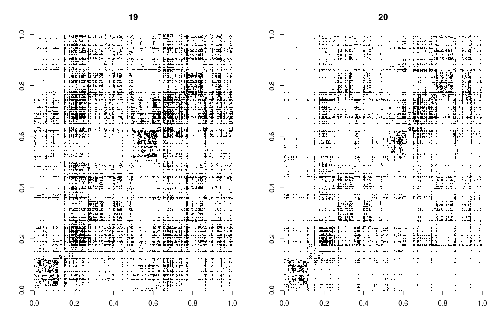
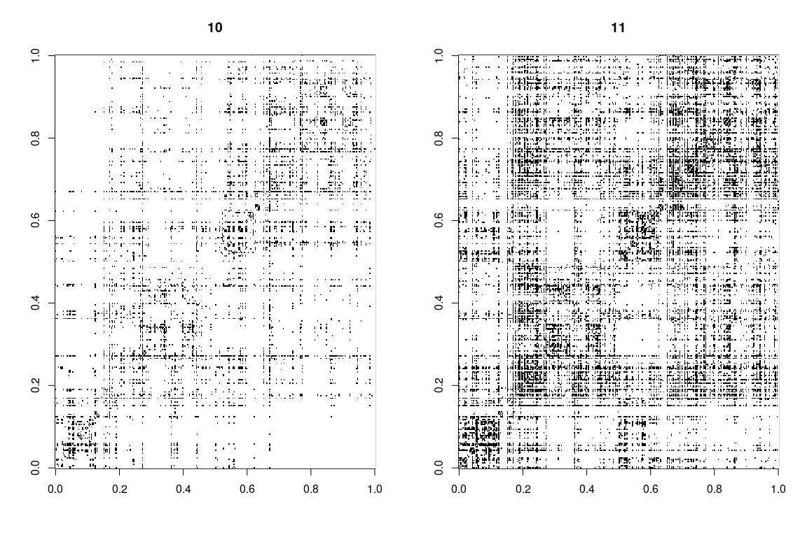

Raw Adjacency Plots
===================

Raw Adjacency Plots for Genotype 1

Raw Adjacency Plots for Genotype 2

Average Adjacency Plots
=======================

Genotype 1

 Genotype 2

Degree Distribution
===================

Plotted over two genotypes

Betweenness Centrality Distribution
===================================

Plotted over two genotypes

