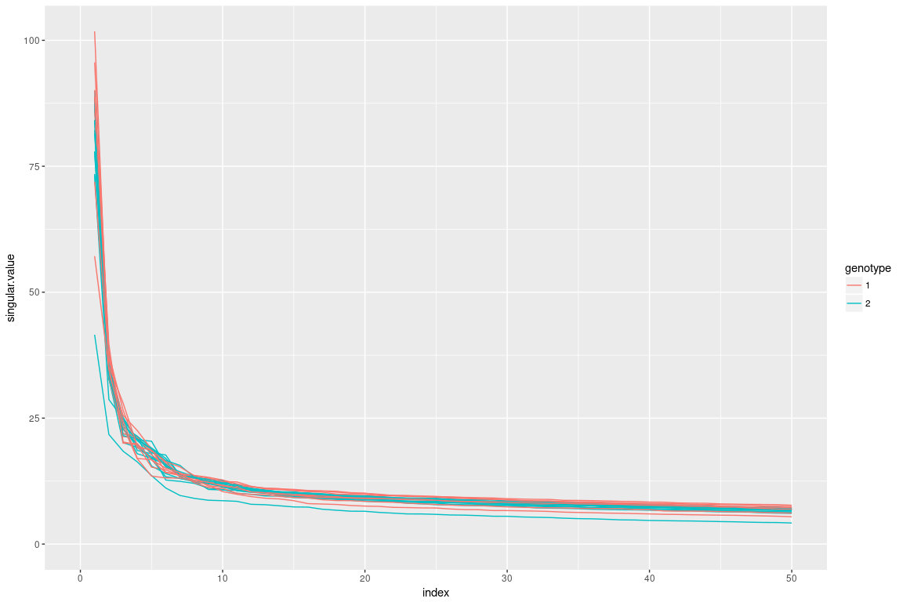
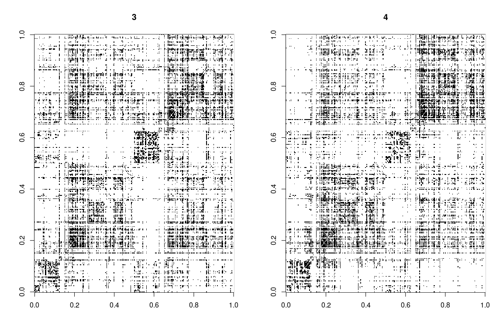
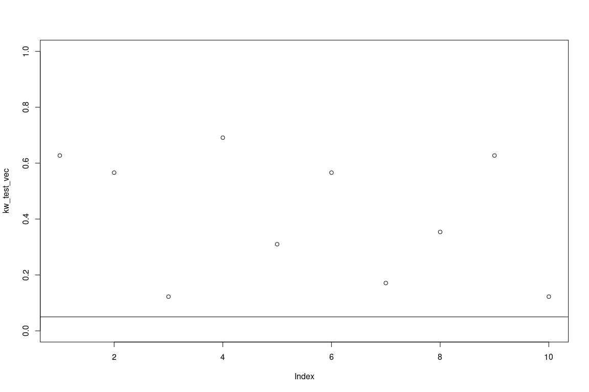
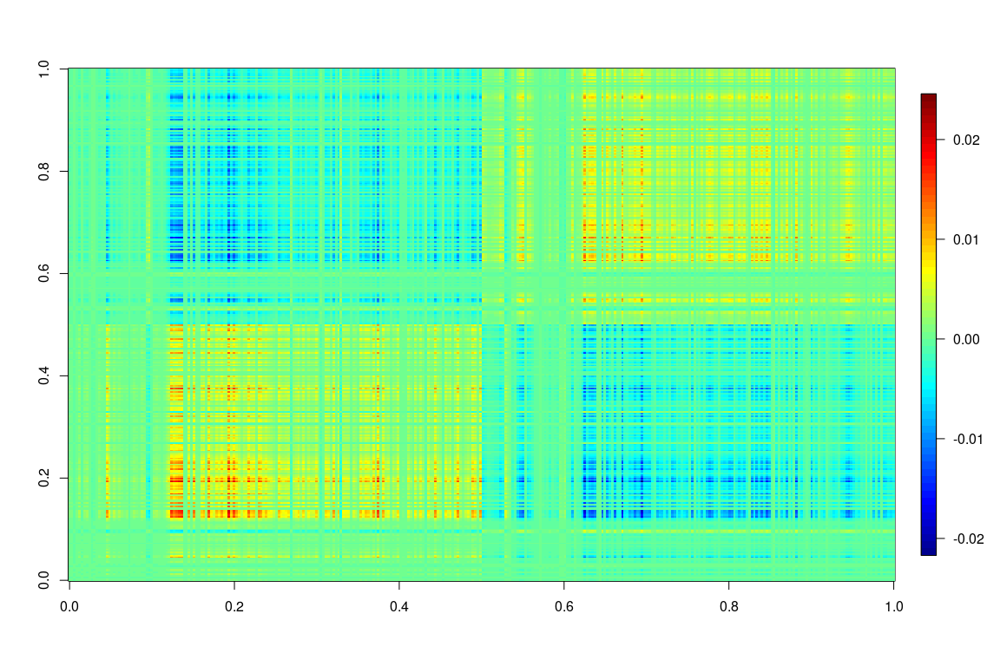
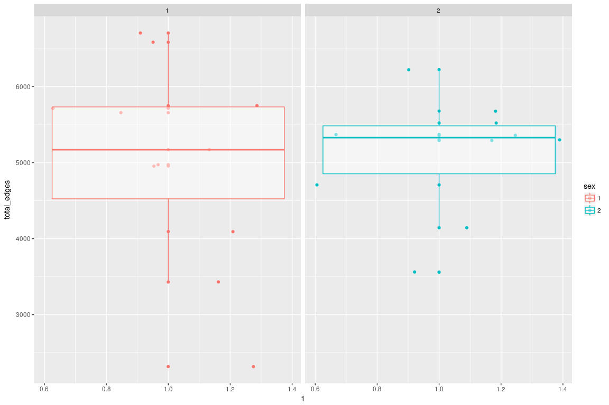
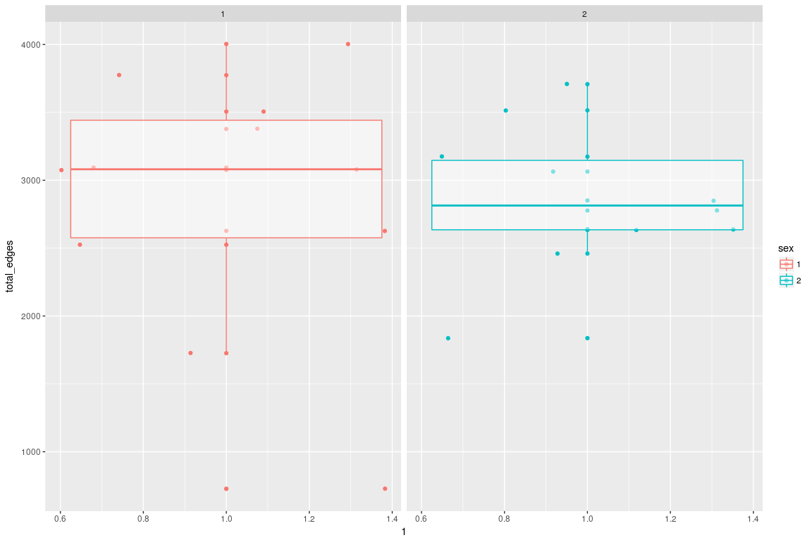

Raw Adjacency Plots
===================

Raw Adjacency Plots for Genotype 1



Raw Adjacency Plots for Genotype 2



Average Adjacency Plots
=======================

Genotype 1

 Genotype 2


Degree Distribution
===================

Plotted over two genotypes


Plotted over two sex 

Betweenness Centrality Distribution
===================================

Plotted over two genotypes



Plotted over two sex


<!-- Genotype1 -->
<!-- ```{r} -->
<!-- par(mfrow=c(1,2)) -->
<!-- for(i in geno1){ -->
<!--     img = as.matrix(LRSumList[[i]]) -->
<!--     image.plot(img,main=i, zlim=c(0,7000)) -->
<!-- } -->
<!-- ``` -->
<!-- Genotype2 -->
<!-- ```{r} -->
<!-- par(mfrow=c(1,2)) -->
<!-- for(i in geno2){ -->
<!--     img = as.matrix(LRSumList[[i]]) -->
<!--     image.plot(img,main=i, zlim=c(0,7000)) -->
<!-- } -->
<!-- ``` -->
<!-- Average -->
<!-- Genotype 1 -->
<!-- ```{r} -->
<!-- Asum = matrix(0, 2,2) -->
<!-- for(i in geno1){ -->
<!--     Asum = Asum + as.matrix(LRSumList[[i]]) -->
<!-- } -->
<!-- avgGeno1 = Asum/length(geno1) -->
<!-- image.plot(avgGeno1, zlim=c(0,7000)) -->
<!-- ``` -->
<!-- Genotype 2 -->
<!-- ```{r} -->
<!-- Asum = matrix(0, 2,2) -->
<!-- for(i in geno2){ -->
<!--     Asum = Asum + as.matrix(LRSumList[[i]]) -->
<!-- } -->
<!-- avgGeno2 = Asum/length(geno2) -->
<!-- image.plot(avgGeno2, zlim=c(0,7000)) -->
<!-- ``` -->
total edges
===========

Over genotype 

    ## 
    ##  Wilcoxon rank sum test
    ## 
    ## data:  x1 and x2
    ## W = 76, p-value = 0.06427
    ## alternative hypothesis: true location shift is greater than 0

    ## 
    ##  Kruskal-Wallis rank sum test
    ## 
    ## data:  df$total_edges by as.factor(df$genotype)
    ## Kruskal-Wallis chi-squared = 2.4444, df = 1, p-value = 0.1179

Over sex 

    ## 
    ##  Wilcoxon rank sum test
    ## 
    ## data:  x1 and x2
    ## W = 58, p-value = 0.8633
    ## alternative hypothesis: true location shift is not equal to 0

    ## 
    ##  Kruskal-Wallis rank sum test
    ## 
    ## data:  df$total_edges by as.factor(df$sex)
    ## Kruskal-Wallis chi-squared = 0.044628, df = 1, p-value = 0.8327

edges in left hemisphere
========================

Over genotype 

    ## 
    ##  Wilcoxon rank sum test
    ## 
    ## data:  x1 and x2
    ## W = 61, p-value = 0.3255
    ## alternative hypothesis: true location shift is greater than 0

    ## 
    ##  Kruskal-Wallis rank sum test
    ## 
    ## data:  df$total_edges by as.factor(df$genotype)
    ## Kruskal-Wallis chi-squared = 0.24747, df = 1, p-value = 0.6189

Over sex 

    ## 
    ##  Wilcoxon rank sum test
    ## 
    ## data:  x1 and x2
    ## W = 52, p-value = 0.8633
    ## alternative hypothesis: true location shift is not equal to 0

    ## 
    ##  Kruskal-Wallis rank sum test
    ## 
    ## data:  df$total_edges by as.factor(df$sex)
    ## Kruskal-Wallis chi-squared = 0.044628, df = 1, p-value = 0.8327

edges in right hemisphere
=========================

Over genotype 

    ## 
    ##  Wilcoxon rank sum test
    ## 
    ## data:  x1 and x2
    ## W = 64, p-value = 0.2539
    ## alternative hypothesis: true location shift is greater than 0

    ## 
    ##  Kruskal-Wallis rank sum test
    ## 
    ## data:  df$total_edges by as.factor(df$genotype)
    ## Kruskal-Wallis chi-squared = 0.50505, df = 1, p-value = 0.4773

Over sex 

    ## 
    ##  Wilcoxon rank sum test
    ## 
    ## data:  x1 and x2
    ## W = 56, p-value = 0.9725
    ## alternative hypothesis: true location shift is not equal to 0

    ## 
    ##  Kruskal-Wallis rank sum test
    ## 
    ## data:  df$total_edges by as.factor(df$sex)
    ## Kruskal-Wallis chi-squared = 0.0049587, df = 1, p-value = 0.9439

edges across left and right
===========================

Over genotype 

    ## 
    ##  Wilcoxon rank sum test
    ## 
    ## data:  x1 and x2
    ## W = 81, p-value = 0.02924
    ## alternative hypothesis: true location shift is greater than 0

    ## 
    ##  Kruskal-Wallis rank sum test
    ## 
    ## data:  df$total_edges by as.factor(df$genotype)
    ## Kruskal-Wallis chi-squared = 3.6818, df = 1, p-value = 0.05501

Over sex 

    ## 
    ##  Wilcoxon rank sum test
    ## 
    ## data:  x1 and x2
    ## W = 61, p-value = 0.7045
    ## alternative hypothesis: true location shift is not equal to 0

    ## 
    ##  Kruskal-Wallis rank sum test
    ## 
    ## data:  df$total_edges by as.factor(df$sex)
    ## Kruskal-Wallis chi-squared = 0.17851, df = 1, p-value = 0.6727
