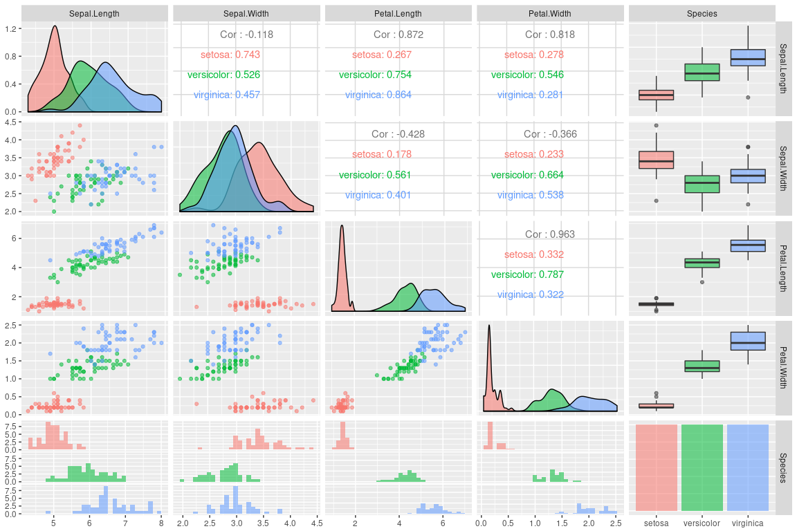
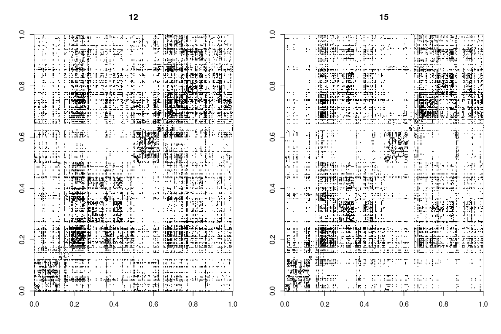
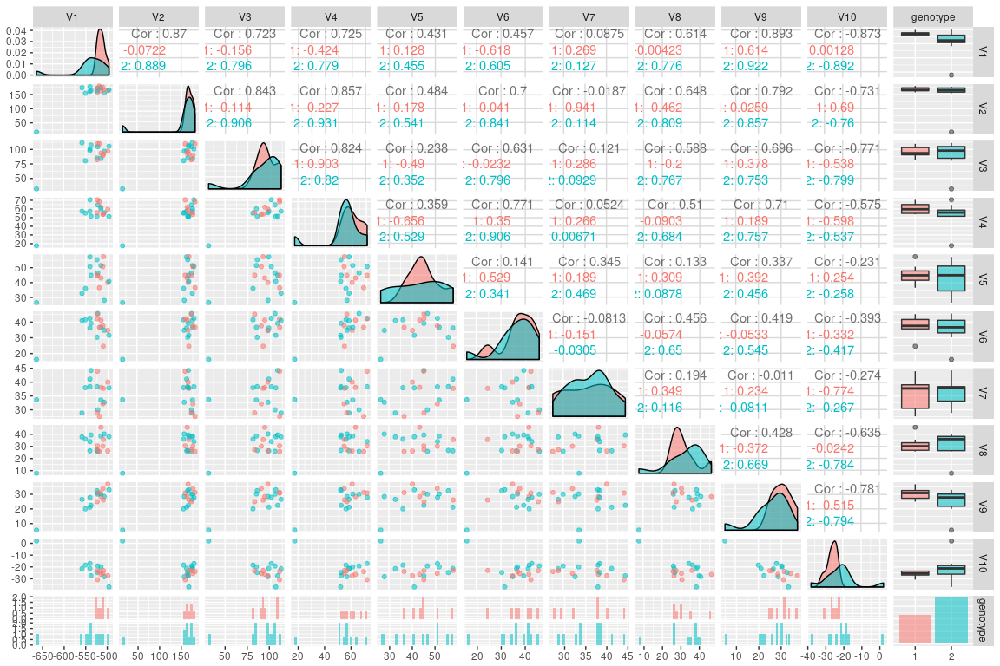
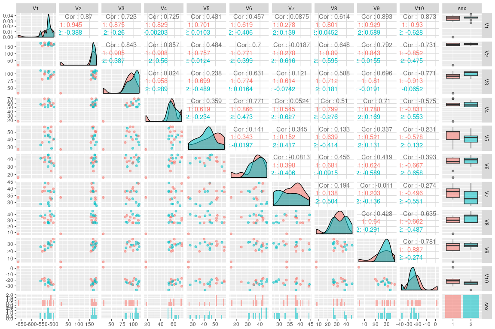
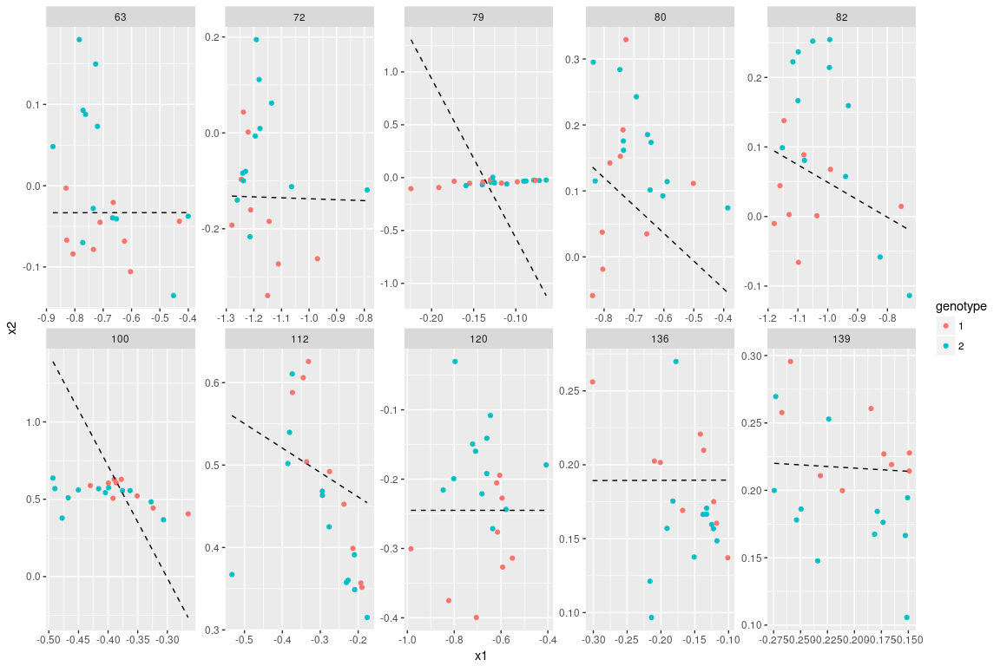
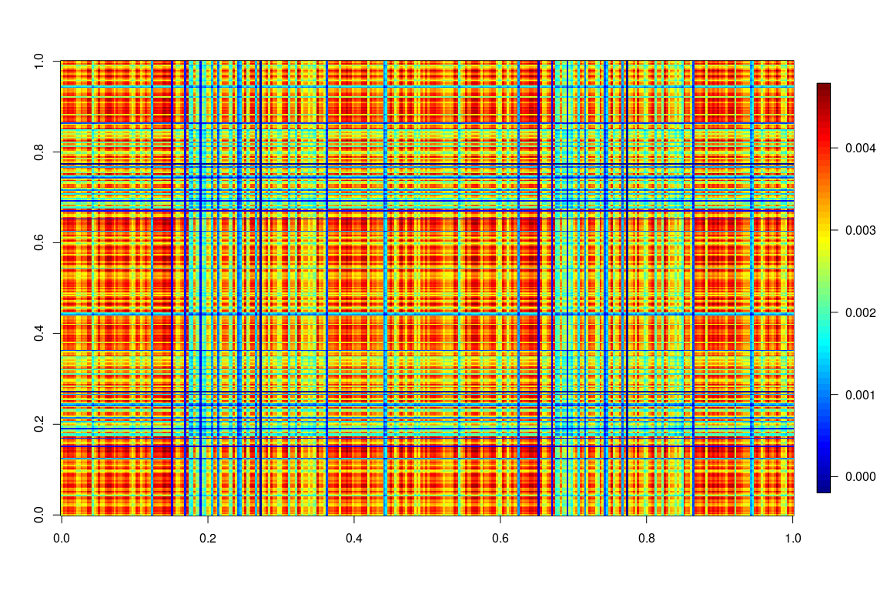
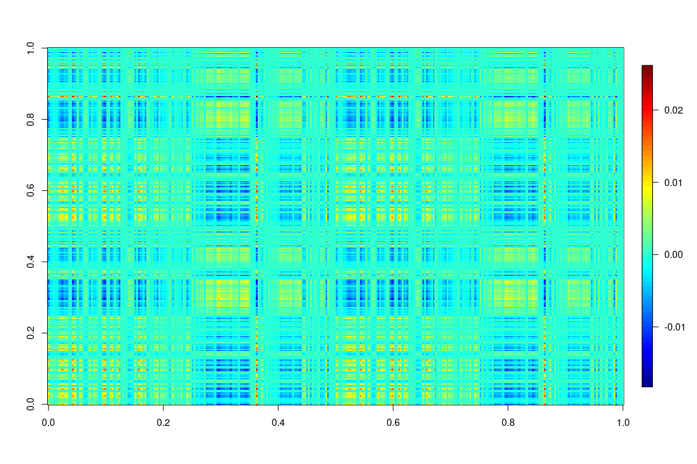
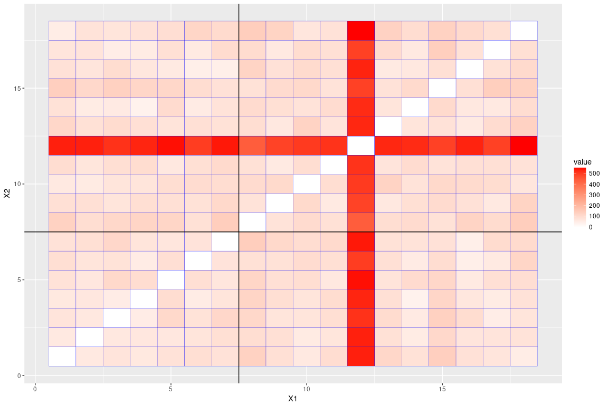
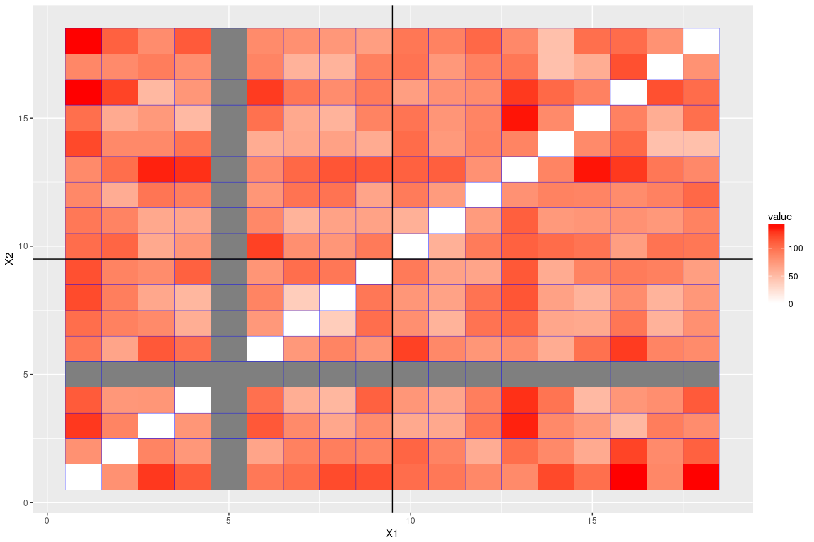

Raw Adjacency Plots
===================

Raw Adjacency Plots for Genotype 1

Raw Adjacency Plots for Genotype 2

Average Adjacency Plots
=======================

Genotype 1

 Genotype 2

Degree Distribution
===================

Plotted over two genotypes

Betweenness Centrality Distribution
===================================

Plotted over two genotypes

Left and Right
==============

Genotype1

Genotype2

Average

Genotype 1

 Genotype 2

Plot the genotype1(black) vs genotype2(red) in the edge count in each block.

total edges
===========

Use MLE for p\_1 and p\_2 in the two binomial population, plug in n^2\*p(1-p) as the two population variance, compute variance, do z-test (as CLT approximation for Binomial)

    ## [1] "z"

    ## [1] 75.53237

    ## [1] "one-sided p-value"

    ## [1] 0

Direct two sample t-test

    ## 
    ##  Welch Two Sample t-test
    ## 
    ## data:  x1 and x2
    ## t = 1.3112, df = 16.988, p-value = 0.1036
    ## alternative hypothesis: true difference in means is greater than 0
    ## 95 percent confidence interval:
    ##  -631.6654       Inf
    ## sample estimates:
    ## mean of x mean of y 
    ##  16555.11  14622.00

edges in left hemisphere
========================

Use MLE for p\_1 and p\_2 in the two binomial population, plug in n^2/4\*p(1-p) as the two population variance, compute variance, do z-test (as CLT approximation for Binomial)

    ## [1] "z"

    ## [1] 11.77203

    ## [1] "one-sided p-value"

    ## [1] 0

Direct two sample t-test

    ## 
    ##  Welch Two Sample t-test
    ## 
    ## data:  x1 and x2
    ## t = 0.70148, df = 16.908, p-value = 0.2463
    ## alternative hypothesis: true difference in means is greater than 0
    ## 95 percent confidence interval:
    ##  -479.5726       Inf
    ## sample estimates:
    ## mean of x mean of y 
    ##  4832.222  4508.333

edges in right hemisphere
=========================

Use MLE for p\_1 and p\_2 in the two binomial population, plug in n^2/4\*p(1-p) as the two population variance, compute variance, do z-test (as CLT approximation for Binomial)

    ## [1] "z"

    ## [1] 15.56627

    ## [1] "one-sided p-value"

    ## [1] 0

Direct two sample t-test

    ## 
    ##  Welch Two Sample t-test
    ## 
    ## data:  x1 and x2
    ## t = 0.92757, df = 16.679, p-value = 0.1834
    ## alternative hypothesis: true difference in means is greater than 0
    ## 95 percent confidence interval:
    ##  -389.2759       Inf
    ## sample estimates:
    ## mean of x mean of y 
    ##  5325.778  4882.167

edges across left and right
===========================

Use MLE for p\_1 and p\_2 in the two binomial population, plug in n^2/4\*p(1-p) as the two population variance, compute variance, do z-test (as CLT approximation for Binomial)

    ## [1] "z"

    ## [1] 25.77095

    ## [1] "one-sided p-value"

    ## [1] 0

Direct two sample t-test

    ## 
    ##  Welch Two Sample t-test
    ## 
    ## data:  x1 and x2
    ## t = 1.8438, df = 17.62, p-value = 0.04105
    ## alternative hypothesis: true difference in means is greater than 0
    ## 95 percent confidence interval:
    ##  34.04205      Inf
    ## sample estimates:
    ## mean of x mean of y 
    ##  3198.556  2615.750
