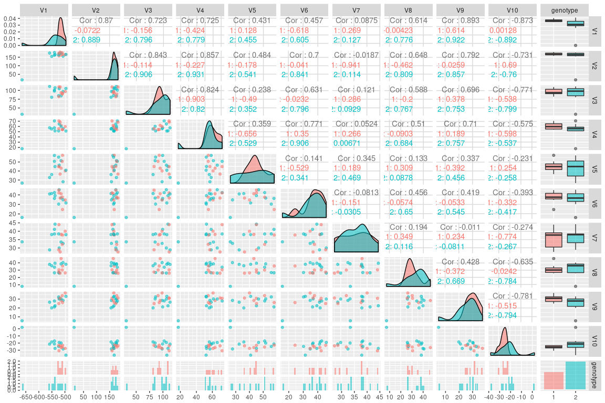
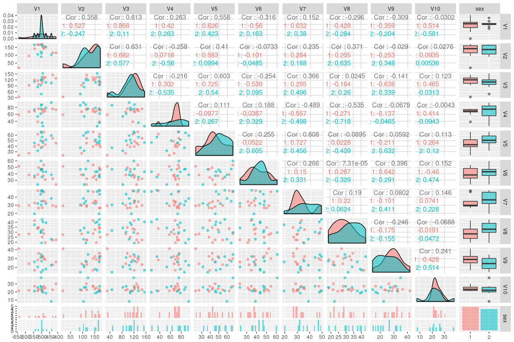

Joint embedding over 10 latent dimensions.

``` r
setwd("~/git/subgraph/mgc_based/")

require('igraph')
```

    ## Loading required package: igraph

    ## 
    ## Attaching package: 'igraph'

    ## The following objects are masked from 'package:stats':
    ## 
    ##     decompose, spectrum

    ## The following object is masked from 'package:base':
    ## 
    ##     union

``` r
require('ggplot2')
```

    ## Loading required package: ggplot2

``` r
require('fields')
```

    ## Loading required package: fields

    ## Loading required package: spam

    ## Loading required package: grid

    ## Spam version 1.4-0 (2016-08-29) is loaded.
    ## Type 'help( Spam)' or 'demo( spam)' for a short introduction 
    ## and overview of this package.
    ## Help for individual functions is also obtained by adding the
    ## suffix '.spam' to the function name, e.g. 'help( chol.spam)'.

    ## 
    ## Attaching package: 'spam'

    ## The following objects are masked from 'package:base':
    ## 
    ##     backsolve, forwardsolve

    ## Loading required package: maps

``` r
options(max.print=100)

listGs<- list.files(path = "../graphml/", pattern = "*.graphml")

#read in covariates and graph list
#find those with common ids, sort by id

covariates<- read.csv("../covariates/predictors.csv",stringsAsFactors = F)
ids <- unlist( lapply(listGs,function(x)strtrim(x,6)))
common_id<- intersect(covariates$RUNNO , ids)

covariates <- covariates[covariates$RUNNO%in%common_id,]
covariates <- covariates[order(covariates$RUNNO),]  

listGs<- listGs[ids%in%common_id]
listGs<- listGs[order(listGs)]

graphList<- lapply(listGs, function(x){
  read.graph( file = paste("../graphml/",x,sep = ""),format = "graphml")
})

AdjacencyList<- lapply(graphList, function(x){
  get.adjacency(x)
})

n = nrow(AdjacencyList[[1]])
half = c(1:(n/2))
reordered = c( half*2-1,half*2)


AdjacencyList<- lapply(AdjacencyList, function(x){
  x[reordered,reordered]
})

HemisphereList<- lapply(graphList, function(x){
  get.vertex.attribute(x,name="hemisphere")
})

DegreeList<- lapply(AdjacencyList, function(x){
  rowSums(as.matrix(x))
  })

####

AdjacencyListPick =  list()
for(i in 1:length(AdjacencyList)){
  if(covariates$GENOTYPE[i]>=1){
    AdjacencyListPick[[length(AdjacencyListPick)+1]] = AdjacencyList[[i]]
  }
}

GENOTYPEPick = covariates$GENOTYPE[covariates$GENOTYPE>=1]

SEXPick = covariates$GENDER[covariates$GENOTYPE>=1]

m = length(GENOTYPEPick)
```

``` r
source("stiefel_diagonalize.r")
```

    ## Loading required package: rstiefel

    ## Loading required package: msm

``` r
r=30

# AdjacencyListPick = lapply(AdjacencyListPick, function(x){as.matrix(x)})

# stiefelDecomp = stiefel_diagonalize(AdjacencyListPick, r)

# save(stiefelDecomp, file="embedding.Rda")
```

``` r
load(file= "embedding.Rda")

Dlist = sapply(stiefelDecomp$D_list,function(x){
  diag(x)
})

D = t(Dlist)


require("GGally")
```

    ## Loading required package: GGally

Pairs plot over genotype

``` r
df = data.frame(as.data.frame(D[,1:10]), "genotype"=as.factor(GENOTYPEPick))

ggpairs(df, aes(colour = genotype, alpha = 0.4))
```

    ## `stat_bin()` using `bins = 30`. Pick better value with `binwidth`.
    ## `stat_bin()` using `bins = 30`. Pick better value with `binwidth`.
    ## `stat_bin()` using `bins = 30`. Pick better value with `binwidth`.
    ## `stat_bin()` using `bins = 30`. Pick better value with `binwidth`.
    ## `stat_bin()` using `bins = 30`. Pick better value with `binwidth`.
    ## `stat_bin()` using `bins = 30`. Pick better value with `binwidth`.
    ## `stat_bin()` using `bins = 30`. Pick better value with `binwidth`.
    ## `stat_bin()` using `bins = 30`. Pick better value with `binwidth`.
    ## `stat_bin()` using `bins = 30`. Pick better value with `binwidth`.
    ## `stat_bin()` using `bins = 30`. Pick better value with `binwidth`.



Pairs plot over sex

``` r
df = data.frame(as.data.frame(D[,1:10]), "sex"=as.factor(SEXPick))

ggpairs(df, aes(colour = sex, alpha = 0.4))
```

    ## `stat_bin()` using `bins = 30`. Pick better value with `binwidth`.
    ## `stat_bin()` using `bins = 30`. Pick better value with `binwidth`.
    ## `stat_bin()` using `bins = 30`. Pick better value with `binwidth`.
    ## `stat_bin()` using `bins = 30`. Pick better value with `binwidth`.
    ## `stat_bin()` using `bins = 30`. Pick better value with `binwidth`.
    ## `stat_bin()` using `bins = 30`. Pick better value with `binwidth`.
    ## `stat_bin()` using `bins = 30`. Pick better value with `binwidth`.
    ## `stat_bin()` using `bins = 30`. Pick better value with `binwidth`.
    ## `stat_bin()` using `bins = 30`. Pick better value with `binwidth`.
    ## `stat_bin()` using `bins = 30`. Pick better value with `binwidth`.


