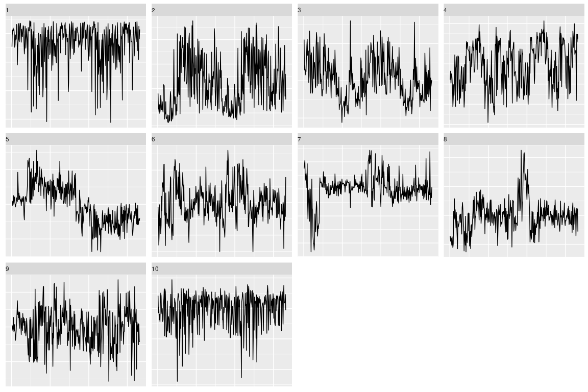
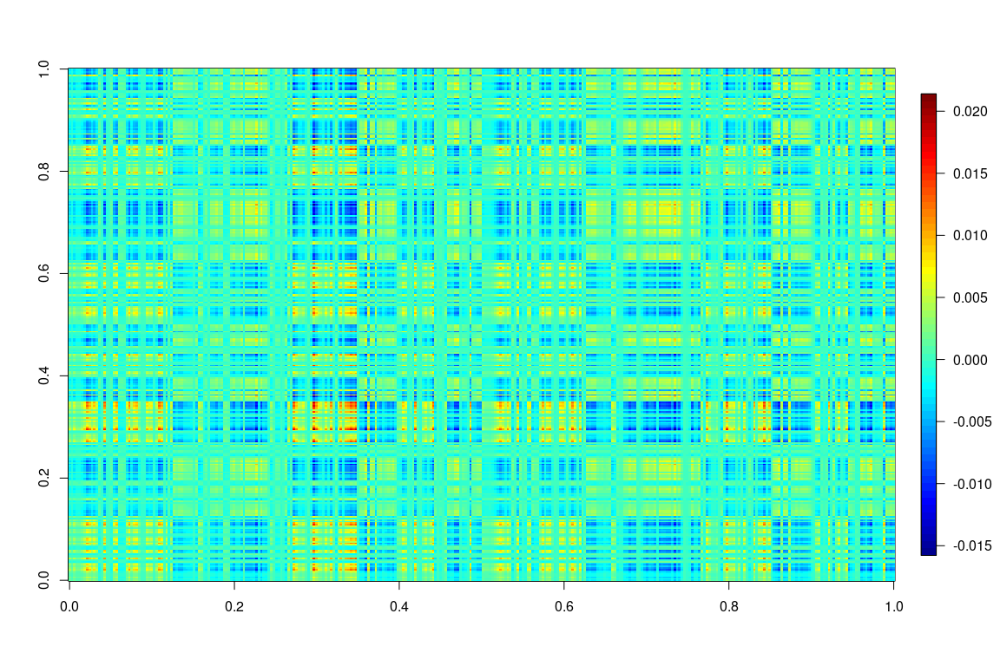
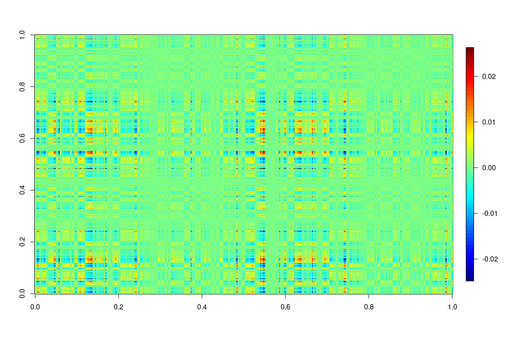
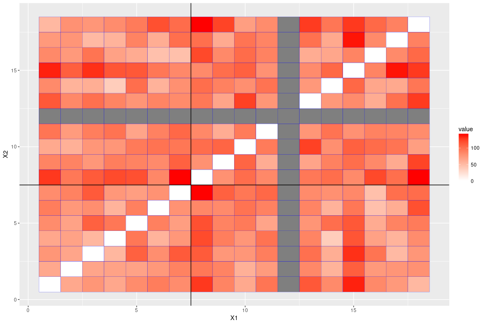

Joint embedding over 10 latent dimensions.

``` r
setwd("~/git/subgraph/mgc_based/")

require('igraph')
```

    ## Loading required package: igraph

    ## 
    ## Attaching package: 'igraph'

    ## The following objects are masked from 'package:stats':
    ## 
    ##     decompose, spectrum

    ## The following object is masked from 'package:base':
    ## 
    ##     union

``` r
require('ggplot2')
```

    ## Loading required package: ggplot2

``` r
require('fields')
```

    ## Loading required package: fields

    ## Loading required package: spam

    ## Loading required package: grid

    ## Spam version 1.4-0 (2016-08-29) is loaded.
    ## Type 'help( Spam)' or 'demo( spam)' for a short introduction 
    ## and overview of this package.
    ## Help for individual functions is also obtained by adding the
    ## suffix '.spam' to the function name, e.g. 'help( chol.spam)'.

    ## 
    ## Attaching package: 'spam'

    ## The following objects are masked from 'package:base':
    ## 
    ##     backsolve, forwardsolve

    ## Loading required package: maps

``` r
options(max.print=100)

listGs<- list.files(path = "../graphml/", pattern = "*.graphml")

#read in covariates and graph list
#find those with common ids, sort by id

covariates<- read.csv("../covariates/predictors.csv",stringsAsFactors = F)
ids <- unlist( lapply(listGs,function(x)strtrim(x,6)))
common_id<- intersect(covariates$RUNNO , ids)

covariates <- covariates[covariates$RUNNO%in%common_id,]
covariates <- covariates[order(covariates$RUNNO),]  

listGs<- listGs[ids%in%common_id]
listGs<- listGs[order(listGs)]

graphList<- lapply(listGs, function(x){
  read.graph( file = paste("../graphml/",x,sep = ""),format = "graphml")
})

AdjacencyList<- lapply(graphList, function(x){
  get.adjacency(x)
})

n = nrow(AdjacencyList[[1]])
half = c(1:(n/2))
reordered = c( half*2-1,half*2)


AdjacencyList<- lapply(AdjacencyList, function(x){
  x[reordered,reordered]
})

HemisphereList<- lapply(graphList, function(x){
  get.vertex.attribute(x,name="hemisphere")
})

DegreeList<- lapply(AdjacencyList, function(x){
  rowSums(as.matrix(x))
  })

####

AdjacencyListPick =  list()
for(i in 1:length(AdjacencyList)){
  if(covariates$GENOTYPE[i]>=1){
    AdjacencyListPick[[length(AdjacencyListPick)+1]] = AdjacencyList[[i]]
  }
}

GENOTYPEPick = covariates$GENOTYPE[covariates$GENOTYPE>=1]

SEXPick = covariates$GENDER[covariates$GENOTYPE>=1]

m = length(GENOTYPEPick)
```

``` r
# source("stiefel_diagonalize.r")
# 
# r=10
# 
# AdjacencyListPick = lapply(AdjacencyListPick, function(x){as.matrix(x)})
# 
# stiefelDecomp = stiefel_diagonalize(AdjacencyListPick, r)
# 
# save(stiefelDecomp, file="embedding.Rda")
```

``` r
load(file= "embedding.Rda")

Dlist = sapply(stiefelDecomp$D_list,function(x){
  diag(x)
})

D = t(Dlist)


require("GGally")
```

    ## Loading required package: GGally

Pairs plot over genotype

``` r
df = data.frame(as.data.frame(D[,1:10]), "genotype"=as.factor(GENOTYPEPick))
ggpairs(df, aes(colour = genotype, alpha = 0.4))
```

    ## `stat_bin()` using `bins = 30`. Pick better value with `binwidth`.
    ## `stat_bin()` using `bins = 30`. Pick better value with `binwidth`.
    ## `stat_bin()` using `bins = 30`. Pick better value with `binwidth`.
    ## `stat_bin()` using `bins = 30`. Pick better value with `binwidth`.
    ## `stat_bin()` using `bins = 30`. Pick better value with `binwidth`.
    ## `stat_bin()` using `bins = 30`. Pick better value with `binwidth`.
    ## `stat_bin()` using `bins = 30`. Pick better value with `binwidth`.
    ## `stat_bin()` using `bins = 30`. Pick better value with `binwidth`.
    ## `stat_bin()` using `bins = 30`. Pick better value with `binwidth`.
    ## `stat_bin()` using `bins = 30`. Pick better value with `binwidth`.


p-value of KW tests for each dimension

``` r
kw_test_vec = numeric(10)

for(i in 1:10){
  kw_test = kruskal.test(D[,i]~as.factor(df$genotype))
  kw_test_vec[i]=kw_test$p.value
}

plot(kw_test_vec, ylim=c(0,1))
abline(h=0.05)
```


p-value of Wilcoxon tests for each dimension

``` r
wilcoxon_test_vec = numeric(10)

for(i in 1:10){
    x1 = D[df$genotype==1,i]
    x2 = D[df$genotype==2,i]
    
    wc_test = wilcox.test(x1,x2, alternative = "two.sided")
    wilcoxon_test_vec[i]=wc_test$p.value
}

plot(wilcoxon_test_vec, ylim=c(0,1))
abline(h=0.05)
```


Pairs plot over sex

``` r
df = data.frame(as.data.frame(D[,1:10]), "sex"=as.factor(SEXPick))
ggpairs(df, aes(colour = sex, alpha = 0.4))
```

    ## `stat_bin()` using `bins = 30`. Pick better value with `binwidth`.
    ## `stat_bin()` using `bins = 30`. Pick better value with `binwidth`.
    ## `stat_bin()` using `bins = 30`. Pick better value with `binwidth`.
    ## `stat_bin()` using `bins = 30`. Pick better value with `binwidth`.
    ## `stat_bin()` using `bins = 30`. Pick better value with `binwidth`.
    ## `stat_bin()` using `bins = 30`. Pick better value with `binwidth`.
    ## `stat_bin()` using `bins = 30`. Pick better value with `binwidth`.
    ## `stat_bin()` using `bins = 30`. Pick better value with `binwidth`.
    ## `stat_bin()` using `bins = 30`. Pick better value with `binwidth`.
    ## `stat_bin()` using `bins = 30`. Pick better value with `binwidth`.


p-value of KW tests for each dimension

``` r
kw_test_vec = numeric(10)

for(i in 1:10){
  kw_test = kruskal.test(D[,i]~as.factor(df$sex))
  kw_test_vec[i]=kw_test$p.value
}

plot(kw_test_vec, ylim=c(0,1))
abline(h=0.05)
```


p-value of Wilcoxon tests for each dimension

``` r
wilcoxon_test_vec = numeric(10)

for(i in 1:10){
    x1 = D[df$sex==1,i]
    x2 = D[df$sex==2,i]
    
    wc_test = wilcox.test(x1,x2, alternative = "two.sided")
    wilcoxon_test_vec[i]=wc_test$p.value
}

plot(wilcoxon_test_vec, ylim=c(0,1))
abline(h=0.05)
```


Plot of eigenvectors
====================

``` r
U = stiefelDecomp$U0[,1:10]

df = data.frame("idx"=c(1:n),"h"=c(U),"dim"=as.factor(rep(c(1:10),each=n)))

ggplot(data=df) + geom_line(aes(x=idx,y=h))+facet_wrap(~dim,scale="free") + 
  theme(axis.title=element_blank(), 
        axis.text.y = element_blank(), axis.ticks = element_blank()) +
  theme(strip.text.y = element_text(angle = 0, vjust=0.2, hjust=0)) +
  theme(axis.title=element_blank(), 
        axis.text.x = element_blank(), axis.ticks = element_blank()) +
  theme(strip.text.x = element_text(angle = 0, vjust=0.2, hjust=0)) 
```



Eigenmaps
=========

1

``` r
image.plot(U[,1]%*%t(U[,1]))
```


2

``` r
image.plot(U[,2]%*%t(U[,2]))
```


3

``` r
image.plot(U[,3]%*%t(U[,3]))
```


4

``` r
image.plot(U[,4]%*%t(U[,4]))
```



5

``` r
image.plot(U[,5]%*%t(U[,5]))
```


6

``` r
image.plot(U[,6]%*%t(U[,6]))
```



T-matrix
========

``` r
D1 = D[,c(1:10)]
T= matrix(0,m,m)

for(i in 1:m){
  for(j in 1:i){
    T[i,j] = norm(D1[i,]-D1[j,])  
    T[j,i] = T[i,j]
  }
}
```

Grouped by genotype

``` r
require(reshape)
```

    ## Loading required package: reshape

``` r
require(plyr)
```

    ## Loading required package: plyr

    ## 
    ## Attaching package: 'plyr'

    ## The following objects are masked from 'package:reshape':
    ## 
    ##     rename, round_any

    ## The following object is masked from 'package:maps':
    ## 
    ##     ozone

``` r
orderByGenotype = order(GENOTYPEPick)
cut = sum(GENOTYPEPick[orderByGenotype] ==1) + 0.5


T1 = T[orderByGenotype,orderByGenotype]
# T1[16,]<-NA
# T1[,16]<-NA


T.m = melt(T1)


ggplot(T.m, aes(X1, X2)) + geom_tile(aes(fill = value),
     colour = "blue") + scale_fill_gradient2(low = "blue",mid="white",
     high = "red") + geom_vline(xintercept=cut) + geom_hline(yintercept=cut)
```


No.12 seems to be outlier, exclude it and plot again:

``` r
T1 = T[orderByGenotype,orderByGenotype]
T1[12,]<-NA
T1[,12]<-NA


T.m = melt(T1)


ggplot(T.m, aes(X1, X2)) + geom_tile(aes(fill = value),
     colour = "blue") + scale_fill_gradient2(low = "blue",mid="white",
     high = "red") + geom_vline(xintercept=cut) + geom_hline(yintercept=cut)
```



It appears genotype 2 (diseased group) is pretty homogeneous, while genotype 1 is not.

Grouped by sex

``` r
require(reshape)
require(plyr)

orderBySex = order(SEXPick)
cut = sum(SEXPick[orderBySex] ==1) + 0.5


T1 = T[orderBySex,orderBySex]
# T1[16,]<-NA
# T1[,16]<-NA


T.m = melt(T1)


ggplot(T.m, aes(X1, X2)) + geom_tile(aes(fill = value),
     colour = "blue") + scale_fill_gradient2(low = "blue",mid="white",
     high = "red") + geom_vline(xintercept=cut) + geom_hline(yintercept=cut)
```


exclude the outlier and plot again:

``` r
T1 = T[orderBySex,orderBySex]
T1[5,]<-NA
T1[,5]<-NA


T.m = melt(T1)


ggplot(T.m, aes(X1, X2)) + geom_tile(aes(fill = value),
     colour = "blue") + scale_fill_gradient2(low = "blue",mid="white",
     high = "red") + geom_vline(xintercept=cut) + geom_hline(yintercept=cut)
```


hard to tell the difference between 2 sex.
