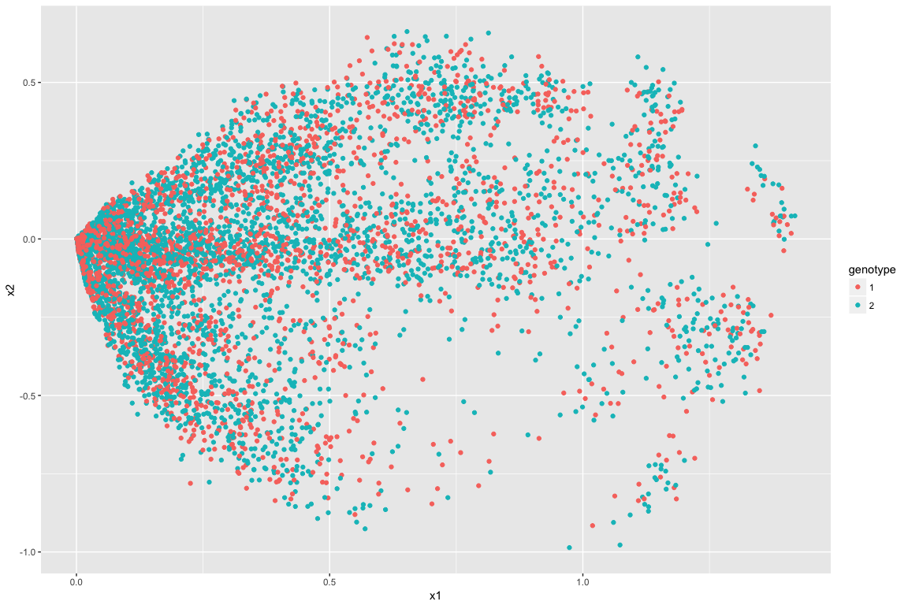
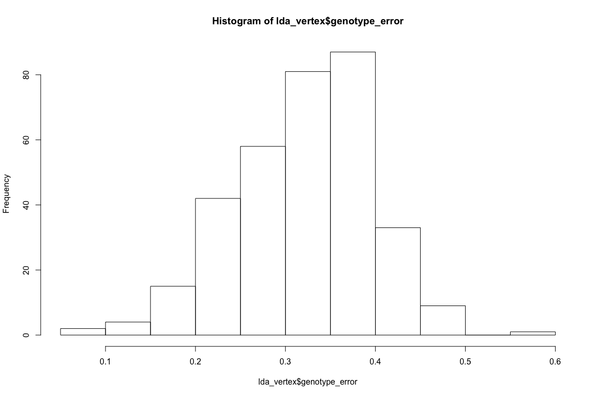
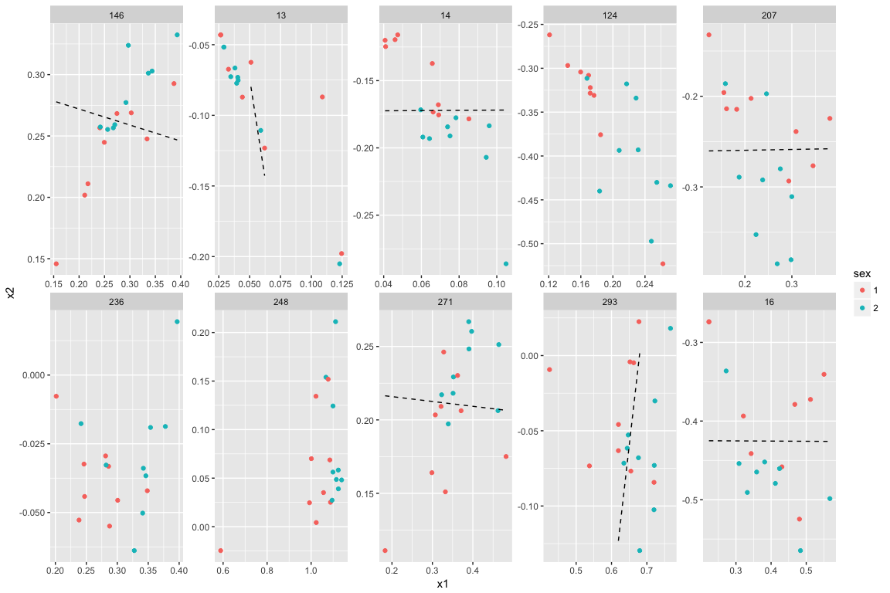
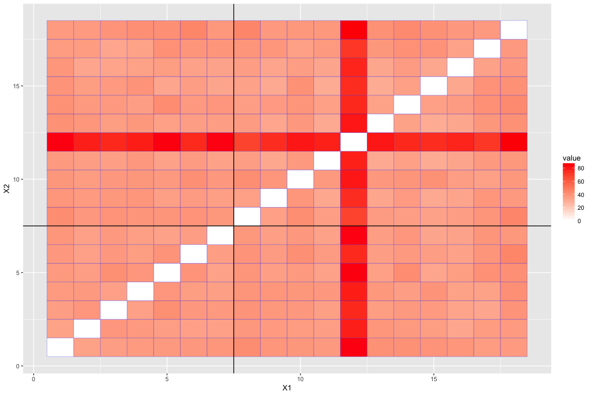
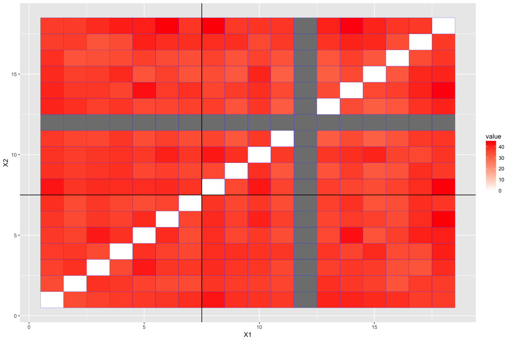
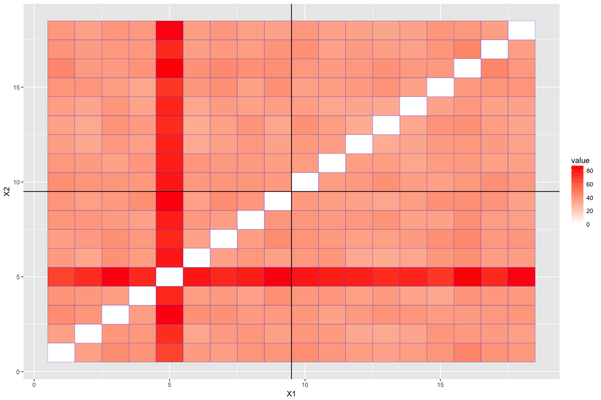

``` r
setwd("~/git/subgraph/mgc_based/")

require('igraph')
```

    ## Loading required package: igraph

    ## 
    ## Attaching package: 'igraph'

    ## The following objects are masked from 'package:stats':
    ## 
    ##     decompose, spectrum

    ## The following object is masked from 'package:base':
    ## 
    ##     union

``` r
require('ggplot2')
```

    ## Loading required package: ggplot2

``` r
require('fields')
```

    ## Loading required package: fields

    ## Loading required package: spam

    ## Loading required package: grid

    ## Spam version 1.4-0 (2016-08-29) is loaded.
    ## Type 'help( Spam)' or 'demo( spam)' for a short introduction 
    ## and overview of this package.
    ## Help for individual functions is also obtained by adding the
    ## suffix '.spam' to the function name, e.g. 'help( chol.spam)'.

    ## 
    ## Attaching package: 'spam'

    ## The following objects are masked from 'package:base':
    ## 
    ##     backsolve, forwardsolve

    ## Loading required package: maps

``` r
options(max.print=100)

listGs<- list.files(path = "../graphml/", pattern = "*.graphml")

#read in covariates and graph list
#find those with common ids, sort by id

covariates<- read.csv("../covariates/predictors.csv",stringsAsFactors = F)
ids <- unlist( lapply(listGs,function(x)strtrim(x,6)))
common_id<- intersect(covariates$RUNNO , ids)

covariates <- covariates[covariates$RUNNO%in%common_id,]
covariates <- covariates[order(covariates$RUNNO),]  

listGs<- listGs[ids%in%common_id]
listGs<- listGs[order(listGs)]

graphList<- lapply(listGs, function(x){
  read.graph( file = paste("../graphml/",x,sep = ""),format = "graphml")
})

AdjacencyList<- lapply(graphList, function(x){
  get.adjacency(x)
})

n = nrow(AdjacencyList[[1]])
half = c(1:(n/2))
reordered = c( half*2-1,half*2)


AdjacencyList<- lapply(AdjacencyList, function(x){
  x[reordered,reordered]
})

HemisphereList<- lapply(graphList, function(x){
  get.vertex.attribute(x,name="hemisphere")
})

DegreeList<- lapply(AdjacencyList, function(x){
  rowSums(as.matrix(x))
  })

####

AdjacencyListPick =  list()
for(i in 1:length(AdjacencyList)){
  if(covariates$GENOTYPE[i]>=1){
    AdjacencyListPick[[length(AdjacencyListPick)+1]] = AdjacencyList[[i]]
  }
}

GENOTYPEPick = covariates$GENOTYPE[covariates$GENOTYPE>=1]

SEXPick = covariates$GENDER[covariates$GENOTYPE>=1]

m = length(GENOTYPEPick)
```

``` r
ase <- function(A, dim){
    if(nrow(A) >= 400){
        require(irlba)
        A.svd <- irlba(A, nu = dim, nv = dim)
        A.svd.values <- A.svd$d[1:dim]
        A.svd.vectors <- A.svd$v[,1:dim]
        if(dim == 1)
            A.coords <- sqrt(A.svd.values) * A.svd.vectors
        else
            A.coords <- A.svd.vectors %*% diag(sqrt(A.svd.values))
    } else{
        A.svd <- svd(A)
        if(dim == 1)
            A.coords <- A.svd$v[,1] * sqrt(A.svd$d[1])
        else
            A.coords <- A.svd$v[,1:dim] %*% diag(sqrt(A.svd$d[1:dim]))
    }

   return(list(Xhat=A.coords,scree=A.svd))
}
```

Omni-embed into 2 dimensions, leading to (332\*2) points for each graph

``` r
# 
# Alist.log <- lapply(AdjacencyListPick, function(x) log(x + t(x)+1))
# Alist.da <- lapply(Alist.log, function(y) y + diag(x=rowSums(y))/(n-1))
# 
# i=1
# 
# dhat <- 2
# Tmat <- normT <- matrix(0,m,m)
# pcol1 <- rep(c(1,3),each=n/2)
# pcol2 <- rep(c(2,4),each=n/2)
# 
# 
# require(Matrix)
# nm = n*m
# # omniA = sparseMatrix(i=1,j=1,x=0, dims=c(nm,nm))
# 
# omniA = matrix(0, nm,nm)
# for(i in 1:m) {
#     for(j in 1:i) {
#         Ad <- as.matrix((Alist.da[[i]] + Alist.da[[j]]) / 2)
#         i_idx1 =  n* (i-1)+1
#         i_idx2 = (n* i)
#         j_idx1 =  n* (j-1)+1
#         j_idx2 = (n* j)
#         omniA[i_idx1: i_idx2,j_idx1: j_idx2] = Ad
#         omniA[j_idx1: j_idx2,i_idx1: i_idx2] = t(Ad)
#     }
#   print(i)
# }
# 
# dmax <- 2
# Xhat.out <- ase(omniA,dmax)
# 
# save(Xhat.out,file ="omni_embedding.Rda")
```

``` r
load(file ="omni_embedding.Rda")
```

``` r
require("ggplot2")

Xhat = Xhat.out$Xhat

df = data.frame( "x1"=Xhat[,1] ,"x2"=Xhat[,2], "id"= as.factor(rep(c(1:m),each=n)),"genotype"= as.factor(rep(GENOTYPEPick,each=n)),"sex"=as.factor(rep(SEXPick,each=n)))
```

Scatterplot, colored by genotype

``` r
ggplot(df, aes(x=x1, y=x2,col=genotype, group=id)) +  geom_point()
```



Scatterplot, colored by sex

``` r
ggplot(df, aes(x=x1, y=x2,col=sex, group=id)) +  geom_point()
```


scatterplot for each vertex
===========================

``` r
Xhat = Xhat.out$Xhat
df0 = data.frame( "x1"=Xhat[,1] ,"x2"=Xhat[,2], "id"= as.factor(rep(c(1:m),each=n)),"genotype"= as.factor(rep(GENOTYPEPick,each=n)),"sex"=as.factor(rep(SEXPick,each=n)), "vertex"= (rep(c(1:n),m)))

df0$genotype.m.x1 = 0
df0$genotype.m.x2 = 0
df0$sex.m.x1 = 0
df0$sex.m.x2 = 0

for(i in 1:n){
  for(j in 1:2){
    pick = (df0$vertex==i) & (df0$genotype==j)
    df0$genotype.m.x1[pick] = median(df0$x1[pick])
    df0$genotype.m.x2[pick] = median(df0$x2[pick])
    
    pick = (df0$vertex==i) & (df0$sex==j)
    df0$sex.m.x1[pick] = median(df0$x1[pick])
    df0$sex.m.x2[pick] = median(df0$x2[pick])
  }
}
tot_i = ceiling(n/10)
```

Compute LDA for each vertex

``` r
require("MASS")
```

    ## Loading required package: MASS

``` r
getDecisionBoundary<- function(fit, x1){
  mu1 = fit$means[1,]
  mu2 = fit$means[2,]
  sigma = 1/fit$scaling^2
  p1 = fit$prior[1]
  p2 = fit$prior[2]
  a0 = log(p1/p2) - 0.5* sum((mu1+mu2)*(mu1-mu2)/sigma)
  a12 = (mu1-mu2)/sigma
  decisionY = (-a0 - a12[1]* X[pick,1])/a12[2]
  decisionY
}


X= cbind(df0$x1,df0$x2)


df0$decisionX2genotype = 0
df0$decisionX2sex = 0

trim<- function(x,y){
  x[x>max(y)]<-NA
  x[x<min(y)]<-NA
  x
}


lda_error = matrix(0, n, 2)
  
for(i in 1:n){

    pick = df0$vertex==i
    
    geno_fit = lda(X[pick,], df$genotype[pick])
    geno_error = sum(predict(geno_fit)$class != df$genotype[pick]) / sum(pick)
    
    df0$decisionX2genotype[pick] = trim(getDecisionBoundary(geno_fit, df0$x1[pick]), df0$x2[pick])
    
    sex_fit = lda(X[pick,], df$sex[pick])
    sex_error = sum(predict(sex_fit)$class != df$sex[pick]) / sum(pick)
    
    df0$decisionX2sex[pick] = trim(getDecisionBoundary(sex_fit, df0$x1[pick]),                                    df0$x2[pick])

    lda_error[i,] = c(geno_error,sex_error)
    
}


lda_vertex= data.frame("vertex" = c(1:n), "genotype_error" = lda_error[,1], "sex_error" = lda_error[,2])


# genotype.lda.rank = rank(lda_vertex$genotype_error, ties.method = "first")
# sex.lda.rank = rank(lda_vertex$sex_error, ties.method = "first")
# df0$genotype.lda.rank = rep(genotype.lda.rank, m)
# df0$sex.lda.rank = rep(sex.lda.rank, m)
```

Over genotype
=============

``` r
df0$vertex = factor(df0$vertex, levels=order(lda_vertex$genotype_error))


for(i in 1:1){

  start_i = (i-1)*10+1
  end_i = min(i*10,n)
  
  

  pick = df0$vertex %in% order(lda_vertex$genotype_error)[start_i:end_i]

  # pick = df0$vertex <= 10 
  df = df0[pick,]
# 
  
#   plot.new()
  print(ggplot(df) +  geom_point(aes(x=x1, y=x2,col=genotype, group=id)) +
          # geom_point(aes(x=genotype.m.x1, y=genotype.m.x2,shape=genotype),alpha=0.5) +
                    geom_line(aes(x=x1, y=decisionX2genotype), linetype=2) +
         facet_wrap(~vertex, ncol=5,scales="free"))

}
```


Histogram of LDA error

``` r
hist(lda_vertex$genotype_error)
```



``` r
sort(lda_vertex$genotype_error)[1:10]
```

    ##  [1] 0.05555556 0.05555556 0.11111111 0.11111111 0.11111111 0.11111111
    ##  [7] 0.16666667 0.16666667 0.16666667 0.16666667

Over sex
========

``` r
df0$vertex = factor(df0$vertex, levels=order(lda_vertex$sex_error))

 
for(i in 1:1){

  start_i = (i-1)*10+1
  end_i = min(i*10,n)

  pick = df0$vertex %in% order(lda_vertex$sex_error)[start_i:end_i]

  # pick = df0$vertex <= 10 
  df = df0[pick,]
# 
  

#   plot.new()
  print(ggplot(df) +  geom_point(aes(x=x1, y=x2,col=sex, group=id)) +
          # geom_point(aes(x=sex.m.x1, y=sex.m.x2,shape=sex),alpha=0.5) +
          geom_line(aes(x=x1, y=decisionX2sex), linetype=2)+
          facet_wrap(~vertex, ncol=5,scales="free"))

}
```



Histogram of LDA error

``` r
hist(lda_vertex$sex_error)
```


``` r
sort(lda_vertex$sex_error)[1:10]
```

    ##  [1] 0.1111111 0.1666667 0.1666667 0.1666667 0.1666667 0.1666667 0.1666667
    ##  [8] 0.1666667 0.1666667 0.2222222

T-matrix
========

``` r
D<- sapply(c(1:m), function(i){
  c( df0$x1[df0$id == i], df0$x2[df0$id == i])
})
  
D1 = t(D)
T= matrix(0,m,m)

for(i in 1:m){
  for(j in 1:i){
    T[i,j] = norm(D1[i,]-D1[j,])  
    T[j,i] = T[i,j]
  }
}
```

Grouped by genotype

``` r
require(reshape)
```

    ## Loading required package: reshape

``` r
require(plyr)
```

    ## Loading required package: plyr

    ## 
    ## Attaching package: 'plyr'

    ## The following objects are masked from 'package:reshape':
    ## 
    ##     rename, round_any

    ## The following object is masked from 'package:maps':
    ## 
    ##     ozone

``` r
orderByGenotype = order(GENOTYPEPick)
cut = sum(GENOTYPEPick[orderByGenotype] ==1) + 0.5


T1 = T[orderByGenotype,orderByGenotype]
# T1[12,]<-NA
# T1[,12]<-NA


T.m = melt(T1)

ggplot(T.m, aes(X1, X2)) + geom_tile(aes(fill = value),
     colour = "blue") + scale_fill_gradient2(low = "blue",mid="white",
     high = "red") + geom_vline(xintercept=cut) + geom_hline(yintercept=cut)
```



excluding 12

``` r
T1 = T[orderByGenotype,orderByGenotype]
T1[12,]<-NA
T1[,12]<-NA


T.m = melt(T1)


ggplot(T.m, aes(X1, X2)) + geom_tile(aes(fill = value),
     colour = "blue") + scale_fill_gradient2(low = "blue",mid="white",
     high = "red") + geom_vline(xintercept=cut) + geom_hline(yintercept=cut)
```



Grouped by sex

``` r
require(reshape)
require(plyr)

orderBySex = order(SEXPick)
cut = sum(SEXPick[orderBySex] ==1) + 0.5


T1 = T[orderBySex,orderBySex]
# T1[12,]<-NA
# T1[,12]<-NA


T.m = melt(T1)


ggplot(T.m, aes(X1, X2)) + geom_tile(aes(fill = value),
     colour = "blue") + scale_fill_gradient2(low = "blue",mid="white",
     high = "red") + geom_vline(xintercept=cut) + geom_hline(yintercept=cut)
```



exclude the outlier and plot again:

``` r
T1 = T[orderBySex,orderBySex]
T1[5,]<-NA
T1[,5]<-NA


T.m = melt(T1)


ggplot(T.m, aes(X1, X2)) + geom_tile(aes(fill = value),
     colour = "blue") + scale_fill_gradient2(low = "blue",mid="white",
     high = "red") + geom_vline(xintercept=cut) + geom_hline(yintercept=cut)
```


