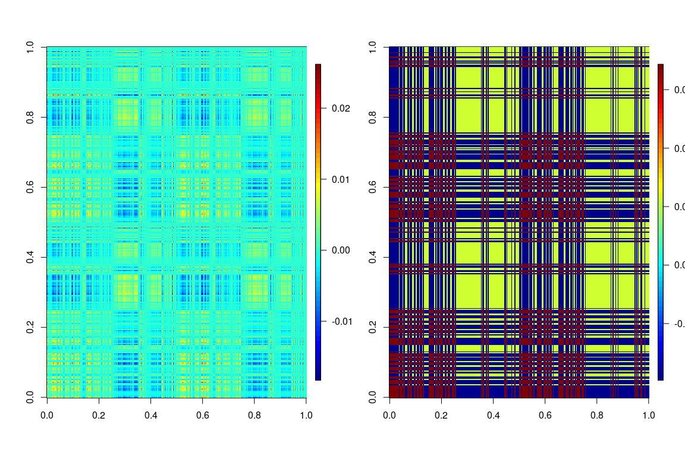
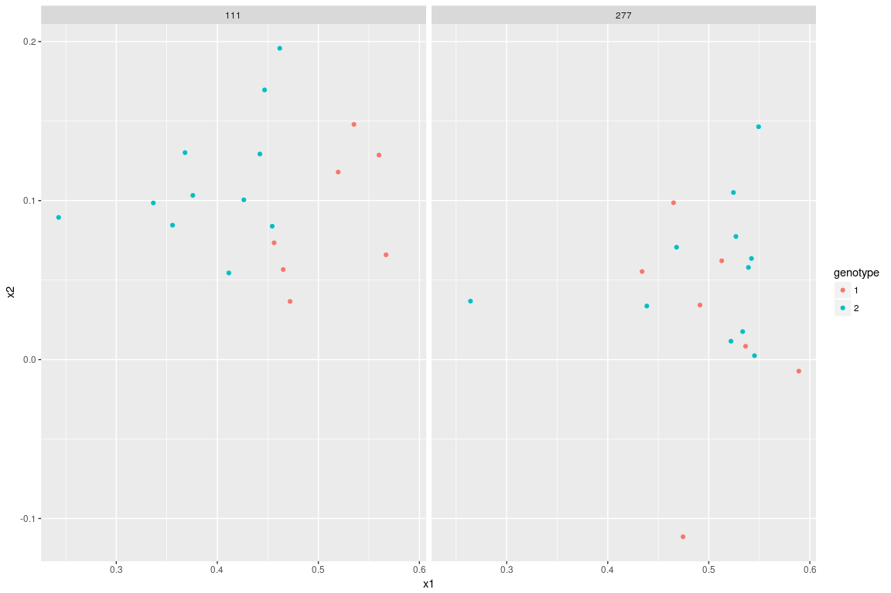

Difference between two genotypes
================================

We focus on comparing subjects with genotype 1 (n1 = 9) and genotype 2 (n2=12).

In the total number of edges on the whole brain, there seems to be a difference between two genotypes.

    ## 
    ##  Wilcoxon rank sum test
    ## 
    ## data:  x1 and x2
    ## W = 62, p-value = 0.01728
    ## alternative hypothesis: true location shift is greater than 0

    ## 
    ##  Kruskal-Wallis rank sum test
    ## 
    ## data:  df$total_edges by as.factor(df$genotype)
    ## Kruskal-Wallis chi-squared = 4.5297, df = 1, p-value = 0.03331

*cross-hemisphere* connections show a significant difference.

    ## 
    ##  Wilcoxon rank sum test
    ## 
    ## data:  x1 and x2
    ## W = 62, p-value = 0.01728
    ## alternative hypothesis: true location shift is greater than 0

    ## 
    ##  Kruskal-Wallis rank sum test
    ## 
    ## data:  df$total_edges by as.factor(df$genotype)
    ## Kruskal-Wallis chi-squared = 4.5297, df = 1, p-value = 0.03331

within-L-hemisphere connections show a significant difference.

    ## 
    ##  Wilcoxon rank sum test
    ## 
    ## data:  x1 and x2
    ## W = 66, p-value = 0.005688
    ## alternative hypothesis: true location shift is greater than 0

    ## 
    ##  Kruskal-Wallis rank sum test
    ## 
    ## data:  df$total_edges by as.factor(df$genotype)
    ## Kruskal-Wallis chi-squared = 6.203, df = 1, p-value = 0.01275

within-R-hemisphere connections do NOT show a significant difference.

    ## 
    ##  Wilcoxon rank sum test
    ## 
    ## data:  x1 and x2
    ## W = 45, p-value = 0.2981
    ## alternative hypothesis: true location shift is greater than 0

    ## 
    ##  Kruskal-Wallis rank sum test
    ## 
    ## data:  df$total_edges by as.factor(df$genotype)
    ## Kruskal-Wallis chi-squared = 0.34655, df = 1, p-value = 0.5561

As a reference, there does not seem to be a clear difference between two sexes:

    ## 
    ##  Wilcoxon rank sum test
    ## 
    ## data:  x1 and x2
    ## W = 42, p-value = 0.9314
    ## alternative hypothesis: true location shift is not equal to 0

    ## 
    ##  Kruskal-Wallis rank sum test
    ## 
    ## data:  df$total_edges by as.factor(df$sex)
    ## Kruskal-Wallis chi-squared = 0.017544, df = 1, p-value = 0.8946

Jointly embedding the graph in low dimensional space
====================================================

The graphs are jointly embedded into low-dimensional space (with d=10). This is equivalent to PCA, except the principle components (factors) are shared among all subjects. The following plots the top 10 factors. 

Each graph is a transform of the linear combination of the 10 eigenmaps.

The left shows the raw estimate, the right shows the clustered estimate. The vertices are sorted by the vertice index in each hemisphere.

Omni-embedding the graph in low dimensional space
=================================================

We use another embedding named omni-embedding. Each graph is embedded into 2-dimensional space. The difference is that the principle components (factors) are NOT shared across subjects.

We found there is some separation of the genotypes on the 2-dimensional representation of one vertex. Vertex 111 and its couterpart in the R hemisphere is shown.

In the degree distribution of vertex 53 over 18 subjects, there is some difference between two genotypes:

    ## 
    ##  Wilcoxon rank sum test with continuity correction
    ## 
    ## data:  x1 and x2
    ## W = 69.5, p-value = 0.002857
    ## alternative hypothesis: true location shift is greater than 0

    ## 
    ##  Kruskal-Wallis rank sum test
    ## 
    ## data:  df1$degree by as.factor(df1$genotype)
    ## Kruskal-Wallis chi-squared = 7.8906, df = 1, p-value = 0.004969

In the degree distribution of vertex 111 over 18 subjects, there is some difference between two genotypes:

    ## 
    ##  Wilcoxon rank sum test with continuity correction
    ## 
    ## data:  x1 and x2
    ## W = 71, p-value = 0.001859
    ## alternative hypothesis: true location shift is greater than 0

    ## 
    ##  Kruskal-Wallis rank sum test
    ## 
    ## data:  df1$degree by as.factor(df1$genotype)
    ## Kruskal-Wallis chi-squared = 8.6816, df = 1, p-value = 0.003214

Other things we assessed but did not find meaningful signal
===========================================================

1.  Difference between total connections within either hemisphere, with respect to sex
2.  Difference between Total connections across hemipheres, with respect to sex
3.  Screening individual vertex without embedding.
