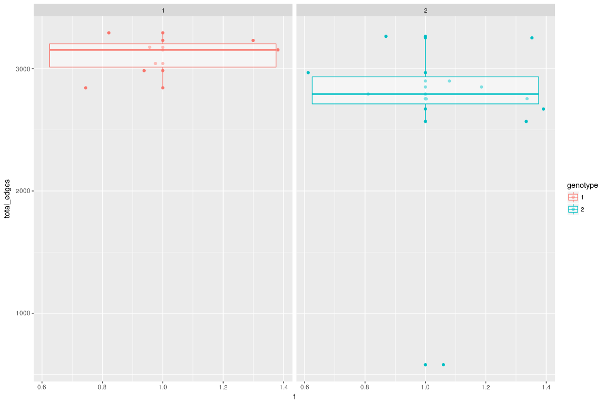

Difference between two genotypes
================================

We focus on comparing subjects with genotype 1 (n1 = 9) and genotype 2 (n2=12).

In the total number of edges on the whole brain, there seems to be a difference between two genotypes, although statistical test does not indicate the difference is significant.

    ## 
    ##  Wilcoxon rank sum test
    ## 
    ## data:  x1 and x2
    ## W = 76, p-value = 0.06427
    ## alternative hypothesis: true location shift is greater than 0

    ## 
    ##  Kruskal-Wallis rank sum test
    ## 
    ## data:  df$total_edges by as.factor(df$genotype)
    ## Kruskal-Wallis chi-squared = 2.4444, df = 1, p-value = 0.1179

As a reference, there does not seem to be a clear difference between two sexes:

    ## 
    ##  Wilcoxon rank sum test
    ## 
    ## data:  x1 and x2
    ## W = 58, p-value = 0.8633
    ## alternative hypothesis: true location shift is not equal to 0

    ## 
    ##  Kruskal-Wallis rank sum test
    ## 
    ## data:  df$total_edges by as.factor(df$sex)
    ## Kruskal-Wallis chi-squared = 0.044628, df = 1, p-value = 0.8327

We found the difference in genotypes is attributed to the number of *cross-hemisphere* connections, which shows a significant difference.

    ## 
    ##  Wilcoxon rank sum test
    ## 
    ## data:  x1 and x2
    ## W = 81, p-value = 0.02924
    ## alternative hypothesis: true location shift is greater than 0

    ## 
    ##  Kruskal-Wallis rank sum test
    ## 
    ## data:  df$total_edges by as.factor(df$genotype)
    ## Kruskal-Wallis chi-squared = 3.6818, df = 1, p-value = 0.05501

Jointly embedding the graph in low dimensional space
====================================================

The graphs are jointly embedded into low-dimensional space (with d=10). This is equivalent to PCA, except the principle components (factors) are shared among all subjects. The following plots the top 10 factors. 

Each graph is a transform of the linear combination of the 10 eigenmaps. We found the 6th eigenmap particularly interesting:

The left shows the raw estimate, the right shows the clustered estimate. The vertices are sorted by the vertice index in each hemisphere.

The same eigenmap sorted by the clustered blocks.

Omni-embedding the graph in low dimensional space
=================================================

We use another embedding named omni-embedding. Each graph is embedded into 2-dimensional space. The difference is that the principle components (factors) are NOT shared across subjects.

We found there is clear separation of the genotypes on the 2-dimensional representation of one vertex. Vertex 111 and its couterpart in the R hemisphere is shown.

In the degree distribution of vertex 111 over 21 subjects, there is some difference between two genotypes:

    ## 
    ##  Wilcoxon rank sum test with continuity correction
    ## 
    ## data:  x1 and x2
    ## W = 92.5, p-value = 0.003398
    ## alternative hypothesis: true location shift is greater than 0

    ## 
    ##  Kruskal-Wallis rank sum test
    ## 
    ## data:  df1$degree by as.factor(df1$genotype)
    ## Kruskal-Wallis chi-squared = 7.5203, df = 1, p-value = 0.006101

Other things we assessed but did not find meaningful signal
===========================================================

1.  Difference between total connections within either hemisphere, with respect to genotype
2.  Difference between total connections within either hemisphere, with respect to sex
3.  Difference between Total connections across hemipheres, with respect to sex
4.  Screening individual vertex without embedding.
