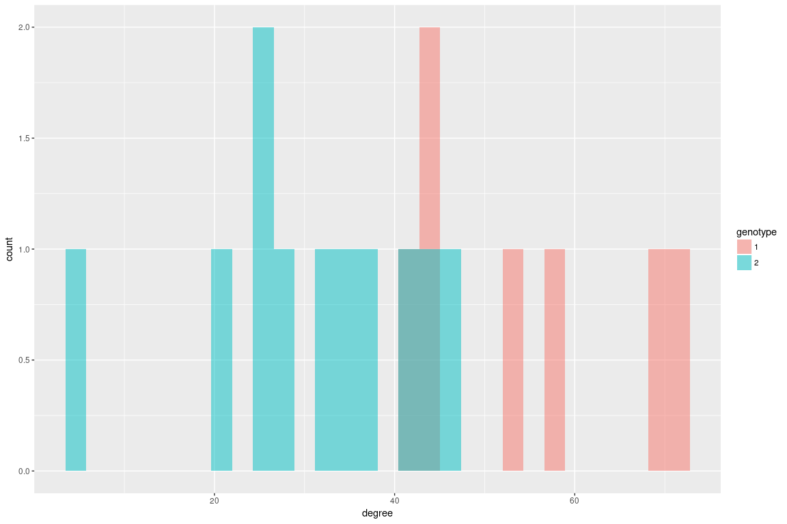
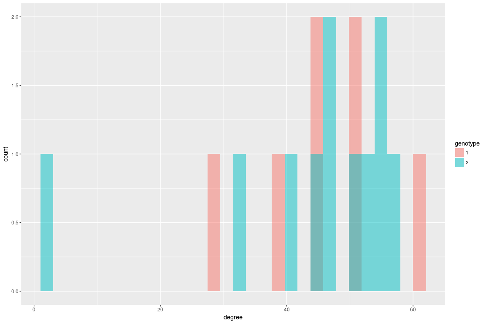
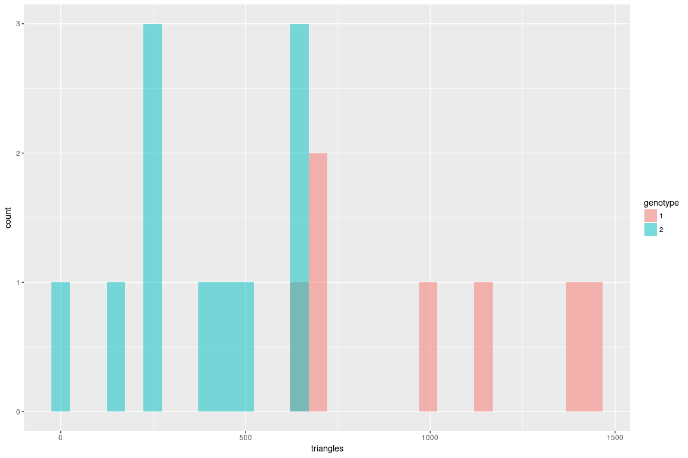
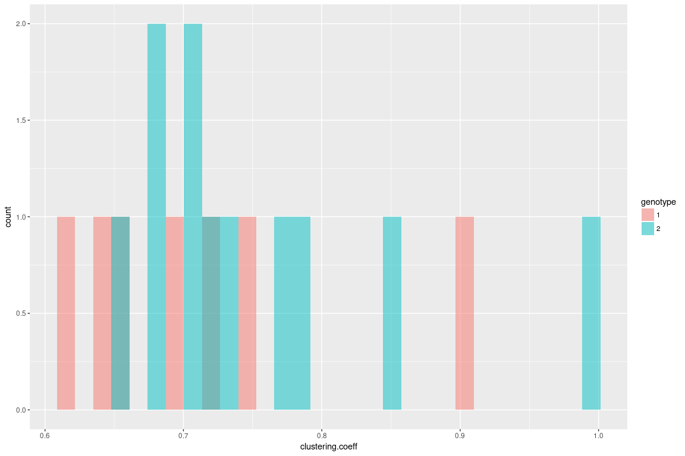
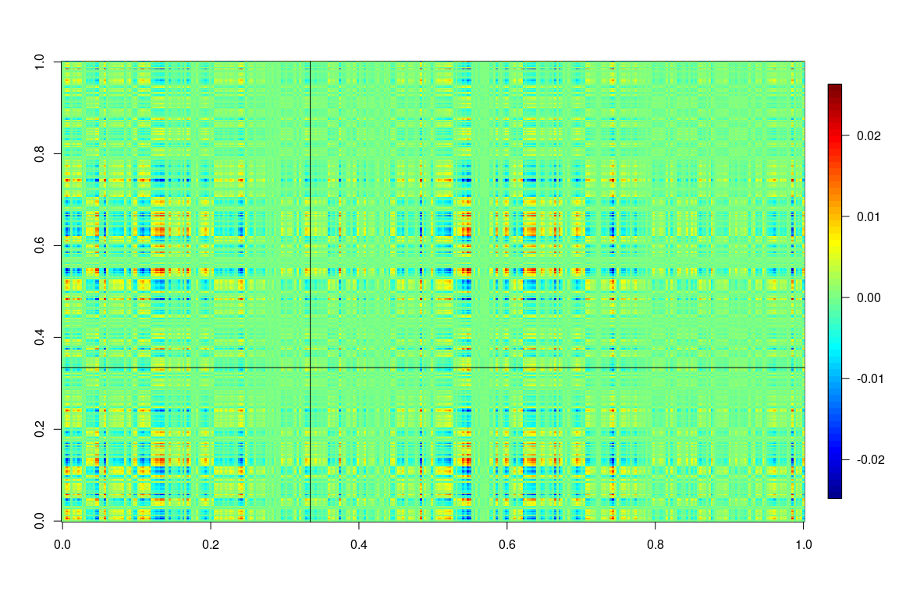

``` r
setwd("~/git/subgraph/mgc_based/")

require('igraph')
```

    ## Loading required package: igraph

    ## 
    ## Attaching package: 'igraph'

    ## The following objects are masked from 'package:stats':
    ## 
    ##     decompose, spectrum

    ## The following object is masked from 'package:base':
    ## 
    ##     union

``` r
require('ggplot2')
```

    ## Loading required package: ggplot2

``` r
require('fields')
```

    ## Loading required package: fields

    ## Loading required package: spam

    ## Loading required package: grid

    ## Spam version 1.4-0 (2016-08-29) is loaded.
    ## Type 'help( Spam)' or 'demo( spam)' for a short introduction 
    ## and overview of this package.
    ## Help for individual functions is also obtained by adding the
    ## suffix '.spam' to the function name, e.g. 'help( chol.spam)'.

    ## 
    ## Attaching package: 'spam'

    ## The following objects are masked from 'package:base':
    ## 
    ##     backsolve, forwardsolve

    ## Loading required package: maps

``` r
options(max.print=100)

listGs<- list.files(path = "../graphml/", pattern = "*.graphml")

#read in covariates and graph list
#find those with common ids, sort by id

covariates<- read.csv("../covariates/predictors.csv",stringsAsFactors = F)
ids <- unlist( lapply(listGs,function(x)strtrim(x,6)))
common_id<- intersect(covariates$RUNNO , ids)

covariates <- covariates[covariates$RUNNO%in%common_id,]
covariates <- covariates[order(covariates$RUNNO),]  

listGs<- listGs[ids%in%common_id]
listGs<- listGs[order(listGs)]

graphList<- lapply(listGs, function(x){
  read.graph( file = paste("../graphml/",x,sep = ""),format = "graphml")
})

AdjacencyList<- lapply(graphList, function(x){
  get.adjacency(x)
})


n = nrow(AdjacencyList[[1]])
half = c(1:(n/2))
reordered = c( half*2-1,half*2)

TriangleList <-  lapply(graphList, function(x){
  a=count_triangles(x)
  a[reordered]
})


CluscoeffList<- lapply(graphList, function(x){
  a=transitivity(x,"local")
  a[reordered]
})

AdjacencyList<- lapply(AdjacencyList, function(x){
  x[reordered,reordered]
})

HemisphereList<- lapply(graphList, function(x){
  get.vertex.attribute(x,name="hemisphere")
})

DegreeList<- lapply(AdjacencyList, function(x){
  rowSums(as.matrix(x))
  })

####

AdjacencyListPick =  list()
TriangleListPick =list()
CluscoeffListPick = list()
for(i in 1:length(AdjacencyList)){
  if(covariates$GENOTYPE[i]>=1){
    AdjacencyListPick[[length(AdjacencyListPick)+1]] = AdjacencyList[[i]]
    TriangleListPick[[length(TriangleListPick)+1]] = TriangleList[[i]]
    CluscoeffListPick[[length(CluscoeffListPick)+1]] = CluscoeffList[[i]]
  }
}


DegreeListPick<- lapply(AdjacencyListPick, function(x){
  rowSums(as.matrix(x))
  })


GENOTYPEPick = covariates$GENOTYPE[covariates$GENOTYPE>=1]

SEXPick = covariates$GENDER[covariates$GENOTYPE>=1]

m = length(GENOTYPEPick)
```

Omni-embed into 2 dimensions, leading to (332\*2) points for each graph

``` r
# 
# Alist.log <- lapply(AdjacencyListPick, function(x) log(x + t(x)+1))
# Alist.da <- lapply(Alist.log, function(y) y + diag(x=rowSums(y))/(n-1))
# 
# i=1
# 
# dhat <- 2
# Tmat <- normT <- matrix(0,m,m)
# pcol1 <- rep(c(1,3),each=n/2)
# pcol2 <- rep(c(2,4),each=n/2)
# 
# 
# require(Matrix)
# nm = n*m
# # omniA = sparseMatrix(i=1,j=1,x=0, dims=c(nm,nm))
# 
# omniA = matrix(0, nm,nm)
# for(i in 1:m) {
#     for(j in 1:i) {
#         Ad <- as.matrix((Alist.da[[i]] + Alist.da[[j]]) / 2)
#         i_idx1 =  n* (i-1)+1 
#         i_idx2 = (n* i)
#         j_idx1 =  n* (j-1)+1 
#         j_idx2 = (n* j)
#         omniA[i_idx1: i_idx2,j_idx1: j_idx2] = Ad
#         omniA[j_idx1: j_idx2,i_idx1: i_idx2] = t(Ad)
#     }
#   print(i)
# }
# 
# dmax <- 2
# Xhat.out <- ase(omniA,dmax)
# 
# save(Xhat.out,file ="omni_embedding.Rda")
```

``` r
load(file ="omni_embedding.Rda")
```

``` r
require("ggplot2")


Xhat = Xhat.out$Xhat
df0 = data.frame( "x1"=Xhat[,1] ,"x2"=Xhat[,2], "id"= as.factor(rep(c(1:m),each=n)),"genotype"= as.factor(rep(GENOTYPEPick,each=n)),"sex"=as.factor(rep(SEXPick,each=n)), "vertex"= (rep(c(1:n),m)))
```

Omni-embedding:
===============

Plot the omin-embedding of vertex 111 and its counterpart in the other hemisphere 277

Scatterplot, colored by genotype

``` r
df1 = df0[df0$vertex %in% c(111, 277),]
ggplot(df1, aes(x=x1, y=x2,col=genotype)) +  geom_point() + facet_wrap(~vertex)
```


Scatterplot, colored by sex

``` r
ggplot(df1, aes(x=x1, y=x2,col=sex)) +  geom_point() + facet_wrap(~vertex)
```

 \#Degress distribution

111

``` r
degree111 = sapply(DegreeListPick, function(x)x[111])


df1 = data.frame( "degree" =  degree111, "genotype" = as.factor(GENOTYPEPick), "sex" = SEXPick)
ggplot(df1) +  geom_histogram(aes(degree,fill=genotype), alpha=.5,position="identity",bins=30) 
```



277

``` r
degree277 = sapply(DegreeListPick, function(x)x[277])

df1 = data.frame( "degree" =  degree277, "genotype" = as.factor(GENOTYPEPick), "sex" = SEXPick)
ggplot(df1) +  geom_histogram(aes(degree,fill=genotype), alpha=.5,position="identity",bins=30) 
```



No. of Triangles
================

111

``` r
triangles = sapply(TriangleListPick, function(x)x[111])

df1 = data.frame( "triangles" =  triangles, "genotype" = as.factor(GENOTYPEPick), "sex" = SEXPick)
ggplot(df1) +  geom_histogram(aes(triangles,fill=genotype), alpha=.5,position="identity",bins=30) 
```



277

``` r
triangles = sapply(TriangleListPick, function(x)x[277])

df1 = data.frame( "triangles" =  triangles, "genotype" = as.factor(GENOTYPEPick), "sex" = SEXPick)
ggplot(df1) +  geom_histogram(aes(triangles,fill=genotype), alpha=.5,position="identity",bins=30)
```


Clustering coefficients
=======================

111

``` r
clustering.coeff = sapply(CluscoeffListPick, function(x)x[111])

df1 = data.frame( "clustering.coeff" =  clustering.coeff, "genotype" = as.factor(GENOTYPEPick), "sex" = SEXPick)
ggplot(df1) +  geom_histogram(aes(clustering.coeff,fill=genotype), alpha=.5,position="identity",bins=30) 
```


277

``` r
clustering.coeff = sapply(CluscoeffListPick, function(x)x[277])

df1 = data.frame( "clustering.coeff" =  clustering.coeff, "genotype" = as.factor(GENOTYPEPick), "sex" = SEXPick)
ggplot(df1) +  geom_histogram(aes(clustering.coeff,fill=genotype), alpha=.5,position="identity",bins=30) 
```



Vertex 111 and 277 in Eigenmap 6
================================

``` r
load(file= "embedding.Rda")
U = stiefelDecomp$U0[,1:10]


U2 = U[,6]%*%t(U[,6])
require("reshape")
```

    ## Loading required package: reshape

``` r
T.m = melt(U2)

cut1 = 111
cut2 = 277

# ggplot(T.m, aes(X1, X2)) + geom_tile(aes(fill = value),
#      colour = "blue") + scale_fill_gradient2(low = "blue",
#      high = "red") + geom_vline(xintercept=cut1) + geom_hline(yintercept=cut1) + geom_vline(xintercept=cut2) + geom_hline(yintercept=cut2)

image.plot(U2)
abline(v= cut1/n)
abline(h= cut1/n)
```



plot the column

``` r
plot(U2[,cut1])
```


Cluster the U\[,6\] with k=3
============================

``` r
km6 = kmeans(U[,6],centers = 3)

U6fitted = km6$centers[km6$cluster]
image.plot(U6fitted%*%t(U6fitted))
```


