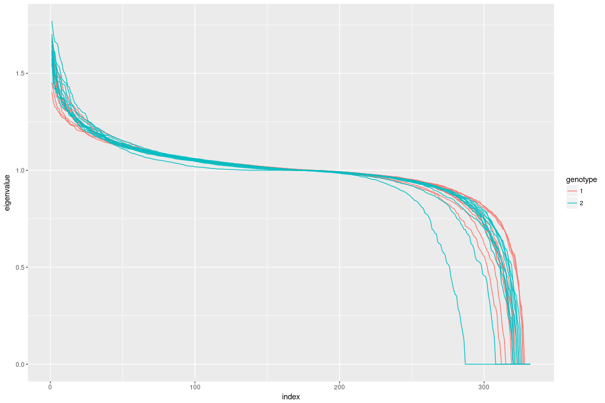
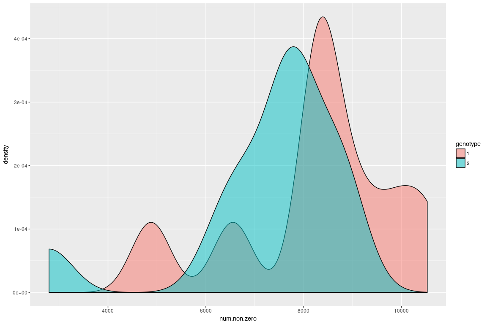

centrality
==========

log clustering coefficient
==========================

degree
======

eigenvalue
==========

locality
========

edge weight
===========

number of non-zeros
===================

Note: the smoothed density is not quite good, because the sample size is quite low.

